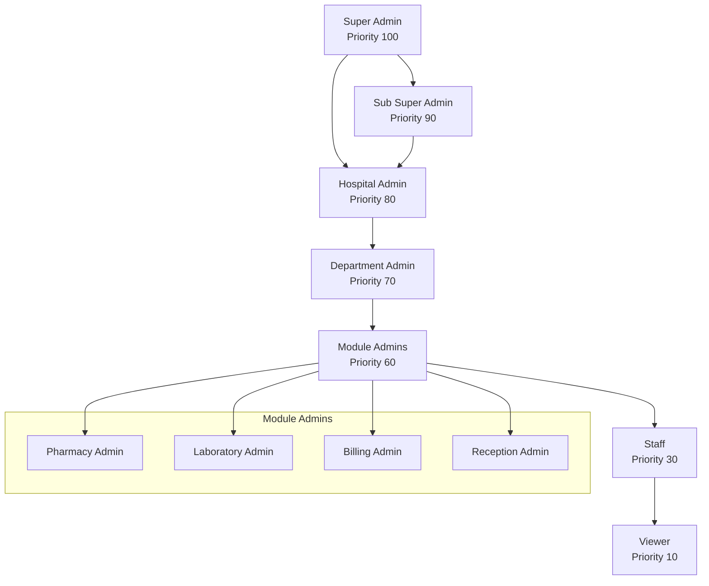
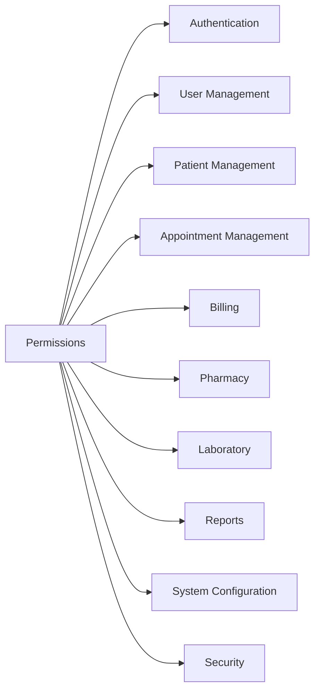
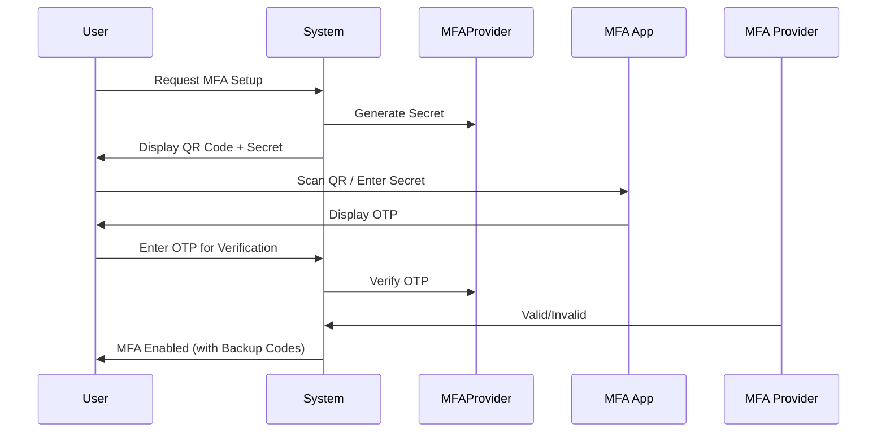
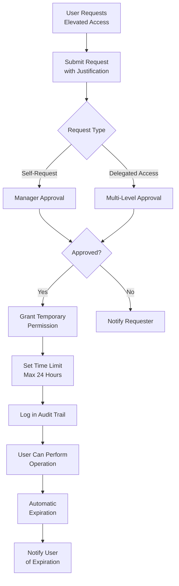
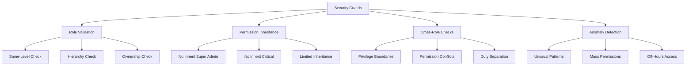

# Hospital Management System - Role-Based Access Control (RBAC) Design Document

## Table of Contents

1. [Executive Summary](#executive-summary)
2. [Role Hierarchy Design](#role-hierarchy-design)
3. [Permission Structure](#permission-structure)
4. [Module-Specific Admin Roles](#module-specific-admin-roles)
5. [MFA Enforcement Rules](#mfa-enforcement-rules)
6. [Session Timeout Policies](#session-timeout-policies)
7. [Permission Escalation Workflow](#permission-escalation-workflow)
8. [Privilege Escalation Prevention](#privilege-escalation-prevention)
9. [Implementation Guidelines](#implementation-guidelines)

---

## Executive Summary

This document outlines the comprehensive Role-Based Access Control (RBAC) system designed for the Hospital Management System (HMS). The system implements a hierarchical role structure with granular permissions, mandatory MFA for privileged roles, session management policies, and safeguards against privilege escalation.

### Key Design Principles

- **Principle of Least Privilege**: Users receive only the permissions necessary to perform their job functions
- **Segregation of Duties**: Critical operations require approval from multiple authorized individuals
- **Auditability**: All permission changes and access attempts are logged for compliance
- **Hierarchical Inheritance**: Permissions flow down the role hierarchy with controlled inheritance

---

## Role Hierarchy Design

### Overview

The role hierarchy implements a tree-based structure where subordinate roles inherit permissions from their parent roles while maintaining their own specific permissions. The hierarchy is prioritized with numeric values to determine access levels and management capabilities.



### Role Definitions

#### 1. Super Admin (Priority 100)

**Access Level**: Unrestricted

**Capabilities**:
- Full system access to all modules and resources
- User management (create, read, update, delete) for all users including Sub Super Admins
- System configuration and security settings management
- Role and permission definition and assignment
- Audit log access and management
- Emergency access grants and revocations
- System-wide settings modification
- Database administration access
- API key and integration management
- Backup and disaster recovery operations

**Restrictions**:
- Cannot delegate Super Admin role to themselves (self-assignment prevention)
- All actions are logged for accountability

**Database Fields**:
```php
'priority' => 100,
'is_system' => true,
'parent_role_id' => null,
'module_access' => ['*'],
'data_visibility_scope' => ['*'],
'user_management_capabilities' => ['*'],
'system_configuration_access' => ['*'],
'reporting_permissions' => ['*'],
'role_specific_limitations' => []
```

#### 2. Sub Super Admin (Priority 90)

**Access Level**: Administrative with restrictions

**Capabilities**:
- Full access to all modules except Super Admin management
- User management for Hospital Admins and below
- Role assignment and permission management
- System configuration access (read and modify)
- Audit log viewing and reporting
- Department management
- Module Admin management

**Restrictions**:
- Cannot manage Super Admin accounts
- Cannot modify Super Admin role permissions
- Cannot access critical security settings
- Cannot create new Super Admin accounts

**Database Fields**:
```php
'priority' => 90,
'is_system' => true,
'parent_role_id' => 1, // Super Admin
'module_access' => ['*'],
'data_visibility_scope' => ['*'],
'user_management_capabilities' => ['manage_users', 'manage_roles', 'manage_departments'],
'system_configuration_access' => ['read', 'modify'],
'reporting_permissions' => ['view', 'export'],
'role_specific_limitations' => ['cannot_manage_super_admin', 'cannot_modify_super_admin_role']
```

#### 3. Hospital Admin (Priority 80)

**Access Level**: Full hospital operations access

**Capabilities**:
- Full access to hospital operations within assigned hospital
- Department management and oversight
- Staff scheduling and assignment
- Patient management (full access)
- Appointment management (full access)
- Billing oversight and reporting
- Inventory management oversight
- Report generation and analytics
- Emergency access to locked records

**Restrictions**:
- Access limited to assigned hospital entity
- Cannot access system-level configurations
- Cannot manage users from other hospitals (multi-tenant)

**Database Fields**:
```php
'priority' => 80,
'is_system' => true,
'parent_role_id' => 2, // Sub Super Admin
'module_access' => ['patients', 'appointments', 'billing', 'pharmacy', 'laboratory', 'departments', 'staff', 'reports'],
'data_visibility_scope' => ['hospital_id' => 'current'],
'user_management_capabilities' => ['manage_staff', 'manage_department_heads'],
'system_configuration_access' => [],
'reporting_permissions' => ['view', 'export', 'generate'],
'role_specific_limitations' => ['hospital_scope_only']
```

#### 4. Department Admin (Priority 70)

**Access Level**: Department-specific access

**Capabilities**:
- Full access to assigned department(s)
- Staff management within department
- Department-specific reports
- Resource allocation within department
- Department budget oversight
- Performance metrics for department

**Restrictions**:
- Access limited to assigned department(s)
- Cannot access other departments' data
- Cannot manage cross-departmental resources

**Database Fields**:
```php
'priority' => 70,
'is_system' => true,
'parent_role_id' => 3, // Hospital Admin
'module_access' => ['department_specific_modules'],
'data_visibility_scope' => ['department_id' => 'assigned'],
'user_management_capabilities' => ['manage_own_staff'],
'system_configuration_access' => [],
'reporting_permissions' => ['view_department', 'export_department'],
'role_specific_limitations' => ['department_scope_only', 'no_cross_department_access']
```

#### 5. Module Admins (Priority 60)

**Access Level**: Module-specific full access

**Capabilities** (per module):
- Full module operations within assigned module
- Module-specific configuration
- Module-specific user management
- Module-specific reports and analytics
- Quality control within module

**Restrictions**:
- Access limited to assigned module(s)
- Cannot modify system-wide settings
- Cross-module access requires explicit permission

**Database Fields**:
```php
'priority' => 60,
'is_system' => true,
'parent_role_id' => 4, // Department Admin
'module_access' => ['specific_module'],
'data_visibility_scope' => ['module' => 'assigned'],
'user_management_capabilities' => [],
'system_configuration_access' => ['module_settings_only'],
'reporting_permissions' => ['view_module', 'export_module'],
'role_specific_limitations' => ['module_scope_only']
```

#### 6. Staff (Priority 30)

**Access Level**: Limited feature access

**Capabilities**:
- Read access to assigned work area data
- Create operations within scope
- Update operations on own assignments
- Limited export capabilities

**Restrictions**:
- Cannot delete records
- Cannot access financial data
- Cannot modify system configurations
- Cannot manage users

**Database Fields**:
```php
'priority' => 30,
'is_system' => true,
'parent_role_id' => 5, // Module Admin
'module_access' => ['assigned_work_area'],
'data_visibility_scope' => ['assigned_patients', 'assigned_tasks'],
'user_management_capabilities' => [],
'system_configuration_access' => [],
'reporting_permissions' => ['view_own', 'export_own'],
'role_specific_limitations' => ['no_delete', 'no_financial_access']
```

#### 7. Viewer (Priority 10)

**Access Level**: Read-only access

**Capabilities**:
- Read access to public information
- View assigned reports
- Read-only dashboards

**Restrictions**:
- No create, update, or delete capabilities
- No export capabilities
- No access to sensitive data
- No system configuration access

**Database Fields**:
```php
'priority' => 10,
'is_system' => true,
'parent_role_id' => 6, // Staff
'module_access' => ['public_info'],
'data_visibility_scope' => ['public' => true],
'user_management_capabilities' => [],
'system_configuration_access' => [],
'reporting_permissions' => ['view_public'],
'role_specific_limitations' => ['read_only', 'no_export']
```

---

## Permission Structure

### Permission Categories

Permissions are organized into logical categories corresponding to system modules and functional areas.



### Category Definitions

#### Authentication (AUTH)

| Permission | Description | Risk Level | Requires MFA |
|-------------|-------------|------------|--------------|
| `auth.login` | Login to the system | Low | No |
| `auth.logout` | Logout from the system | Low | No |
| `auth.mfa.enable` | Enable MFA for own account | Medium | Yes |
| `auth.mfa.disable` | Disable MFA for own account | Medium | Yes |
| `auth.mfa.manage` | Manage MFA for other users | High | Yes |
| `auth.password.reset` | Reset user passwords | High | Yes |
| `auth.password.change` | Change own password | Low | No |
| `auth.session.view` | View active sessions | Medium | Yes |
| `auth.session.terminate` | Terminate sessions | High | Yes |

#### User Management (USR)

| Permission | Description | Risk Level | Requires MFA |
|-------------|-------------|------------|--------------|
| `users.view` | View user list | Low | No |
| `users.view_all` | View all users including sensitive data | Medium | Yes |
| `users.create` | Create new users | Medium | Yes |
| `users.update` | Update user information | Medium | Yes |
| `users.delete` | Delete users | High | Yes |
| `users.manage_roles` | Assign roles to users | High | Yes |
| `users.manage_permissions` | Assign permissions to users | High | Yes |
| `users.export` | Export user data | Medium | Yes |
| `users.view_audit` | View user audit logs | Medium | Yes |

#### Patient Management (PAT)

| Permission | Description | Risk Level | Requires MFA |
|-------------|-------------|------------|--------------|
| `patients.view` | View patient list | Low | No |
| `patients.view_own` | View assigned patients only | Low | No |
| `patients.create` | Register new patients | Medium | No |
| `patients.update` | Update patient information | Medium | No |
| `patients.delete` | Delete patient records | High | Yes |
| `patients.medical_records` | Access medical records | Medium | No |
| `patients.medical_records.write` | Write medical records | Medium | No |
| `patients.history` | View patient history | Medium | No |
| `patients.export` | Export patient data | Medium | Yes |
| `patients.merge` | Merge duplicate patient records | High | Yes |
| `patients.access_locked` | Access locked patient records | Critical | Yes |

#### Appointment Management (APT)

| Permission | Description | Risk Level | Requires MFA |
|-------------|-------------|------------|--------------|
| `appointments.view` | View appointment list | Low | No |
| `appointments.view_own` | View own appointments | Low | No |
| `appointments.create` | Create appointments | Low | No |
| `appointments.update` | Update appointments | Low | No |
| `appointments.delete` | Cancel/delete appointments | Medium | No |
| `appointments.approve` | Approve appointments | Medium | No |
| `appointments.manage_all` | Manage all appointments | Medium | No |
| `appointments.export` | Export appointment data | Low | No |

#### Billing (BLL)

| Permission | Description | Risk Level | Requires MFA |
|-------------|-------------|------------|--------------|
| `billing.view` | View billing information | Medium | No |
| `billing.view_own` | View own billing data | Low | No |
| `billing.create` | Create invoices/bills | Medium | No |
| `billing.update` | Update billing records | Medium | No |
| `billing.delete` | Delete billing records | High | Yes |
| `billing.approve` | Approve billing transactions | Medium | No |
| `billing.refund` | Process refunds | High | Yes |
| `billing.waive` | Waive charges | High | Yes |
| `billing.payment.process` | Process payments | Medium | No |
| `billing.insurance` | Manage insurance claims | Medium | No |
| `billing.insurance.approve` | Approve insurance claims | Medium | No |
| `billing.reports` | View billing reports | Medium | No |
| `billing.export` | Export billing data | Medium | Yes |
| `billing.void` | Void invoices | High | Yes |

#### Pharmacy (PHM)

| Permission | Description | Risk Level | Requires MFA |
|-------------|-------------|------------|--------------|
| `pharmacy.view` | View pharmacy data | Low | No |
| `pharmacy.medicines.view` | View medicine inventory | Low | No |
| `pharmacy.medicines.create` | Add new medicines | Medium | No |
| `pharmacy.medicines.update` | Update medicine information | Medium | No |
| `pharmacy.medicines.delete` | Delete medicines | High | Yes |
| `pharmacy.inventory` | Manage inventory | Medium | No |
| `pharmacy.inventory.adjust` | Adjust inventory levels | Medium | No |
| `pharmacy.stock.receive` | Receive stock | Medium | No |
| `pharmacy.stock.count` | Perform stock count | Medium | No |
| `pharmacy.sales` | Process sales | Medium | No |
| `pharmacy.prescriptions` | Process prescriptions | Medium | No |
| `pharmacy.suppliers` | Manage suppliers | Medium | No |
| `pharmacy.orders` | Manage purchase orders | Medium | No |
| `pharmacy.reports` | View pharmacy reports | Medium | No |
| `pharmacy.reports.export` | Export pharmacy reports | Medium | Yes |
| `pharmacy.alerts.manage` | Manage alerts | Medium | No |
| `pharmacy.categories` | Manage categories | Medium | No |

#### Laboratory (LAB)

| Permission | Description | Risk Level | Requires MFA |
|-------------|-------------|------------|--------------|
| `laboratory.view` | View laboratory data | Low | No |
| `laboratory.tests.view` | View available tests | Low | No |
| `laboratory.tests.create` | Create new test types | Medium | No |
| `laboratory.tests.update` | Update test configurations | Medium | No |
| `laboratory.tests.delete` | Delete test types | High | Yes |
| `laboratory.requests.view` | View test requests | Low | No |
| `laboratory.requests.create` | Create test requests | Low | No |
| `laboratory.requests.process` | Process test requests | Medium | No |
| `laboratory.results.view` | View test results | Medium | No |
| `laboratory.results.enter` | Enter test results | Medium | No |
| `laboratory.results.validate` | Validate test results | Medium | No |
| `laboratory.results.critical` | Handle critical values | Medium | No |
| `laboratory.quality` | Quality control | Medium | No |
| `laboratory.reports` | View laboratory reports | Medium | No |
| `laboratory.reports.export` | Export laboratory reports | Medium | Yes |

#### Reports (RPT)

| Permission | Description | Risk Level | Requires MFA |
|-------------|-------------|------------|--------------|
| `reports.view` | View reports | Low | No |
| `reports.create` | Create custom reports | Medium | No |
| `reports.export` | Export reports | Medium | Yes |
| `reports.scheduled` | Manage scheduled reports | Medium | No |
| `reports.audit` | View audit reports | Medium | Yes |
| `reports.financial` | View financial reports | Medium | Yes |
| `reports.hospital` | View hospital-wide reports | Medium | Yes |
| `reports.department` | View department reports | Medium | No |
| `reports.compliance` | View compliance reports | High | Yes |

#### System Configuration (SYS)

| Permission | Description | Risk Level | Requires MFA |
|-------------|-------------|------------|--------------|
| `system.settings.view` | View system settings | Medium | Yes |
| `system.settings.update` | Update system settings | High | Yes |
| `system.backup` | Manage backups | High | Yes |
| `system.restore` | Restore from backup | Critical | Yes |
| `system.maintenance` | Perform maintenance | High | Yes |
| `system.logging` | Manage logging settings | High | Yes |
| `system.api.manage` | Manage API keys | High | Yes |
| `system.integrations` | Manage integrations | High | Yes |
| `system.cache` | Manage cache | Medium | Yes |
| `system.departments` | Manage departments | High | Yes |

#### Security (SEC)

| Permission | Description | Risk Level | Requires MFA |
|-------------|-------------|------------|--------------|
| `security.audit` | View audit logs | Medium | Yes |
| `security.alerts` | View security alerts | Medium | Yes |
| `security.mfa` | Manage MFA settings | High | Yes |
| `security.password.policy` | Manage password policy | High | Yes |
| `security.ip_restrictions` | Manage IP restrictions | High | Yes |
| `security.sessions` | Manage sessions | Medium | Yes |
| `security.analyze` | Security analysis | High | Yes |
| `security.block` | Block users/IPs | High | Yes |

### Permission Actions

Each permission supports specific actions:

| Action | Description | Example |
|--------|-------------|---------|
| `create` | Add new records | `patients.create`, `users.create` |
| `read` | View records | `patients.view`, `reports.view` |
| `update` | Modify existing records | `patients.update`, `billing.update` |
| `delete` | Remove records | `users.delete`, `billing.delete` |
| `approve` | Approve operations | `billing.approve`, `appointments.approve` |
| `export` | Export data | `patients.export`, `billing.export` |
| `manage` | Full administrative control | `users.manage_roles` |
| `view_own` | View own assigned records | `patients.view_own` |
| `view_all` | View all records regardless of assignment | `patients.view_all` |

### Permission Naming Convention

```
<category>.<resource>.<action>
```

Examples:
- `patients.medical_records.write` - Write medical records for patients
- `billing.invoices.approve` - Approve billing invoices
- `pharmacy.inventory.adjust` - Adjust pharmacy inventory levels
- `laboratory.results.validate` - Validate laboratory test results

---

## Module-Specific Admin Roles

### Pharmacy Admin

**Reports To**: Hospital Admin

**Department Scope**: Pharmacy Department

**Permissions**:

| Category | Permission | Access Level |
|----------|------------|--------------|
| Medicines | `pharmacy.medicines.*` | Full |
| Inventory | `pharmacy.inventory.*` | Full |
| Sales | `pharmacy.sales.*` | Full |
| Suppliers | `pharmacy.suppliers.*` | Full |
| Purchase Orders | `pharmacy.orders.*` | Full |
| Reports | `pharmacy.reports.*` | Full |
| Alerts | `pharmacy.alerts.*` | Full |
| Categories | `pharmacy.categories.*` | Full |
| Users | `users.view` | Read-only |
| Users | `users.manage_pharmacy_staff` | Limited |

**Additional Capabilities**:
- Medicine pricing configuration
- Supplier management
- Inventory reorder point settings
- Expiry alert thresholds
- Discount policies for medicines

**Data Visibility**:
```php
'data_visibility_scope' => [
    'pharmacy_inventory' => true,
    'pharmacy_sales' => true,
    'pharmacy_orders' => true,
    'medicine_master' => true,
    'supplier_information' => true,
    'patient_prescriptions' => 'own_module'
]
```

### Laboratory Admin

**Reports To**: Hospital Admin

**Department Scope**: Laboratory Department

**Permissions**:

| Category | Permission | Access Level |
|----------|------------|--------------|
| Tests | `laboratory.tests.*` | Full |
| Requests | `laboratory.requests.*` | Full |
| Results | `laboratory.results.*` | Full |
| Quality Control | `laboratory.quality.*` | Full |
| Reports | `laboratory.reports.*` | Full |
| Patients | `patients.view` | Read-only |
| Patients | `patients.medical_records` | Read-only |

**Additional Capabilities**:
- Test catalog management
- Reference range configuration
- Quality control settings
- Critical value notification rules
- Test turnaround time monitoring

**Data Visibility**:
```php
'data_visibility_scope' => [
    'lab_tests' => true,
    'lab_results' => true,
    'lab_requests' => true,
    'quality_control_data' => true,
    'patient_information' => 'limited_medical_context'
]
```

### Billing Admin

**Reports To**: Hospital Admin

**Department Scope**: Billing/Finance Department

**Permissions**:

| Category | Permission | Access Level |
|----------|------------|--------------|
| Invoices | `billing.invoices.*` | Full |
| Payments | `billing.payment.*` | Full |
| Refunds | `billing.refund.*` | Full (with limits) |
| Insurance | `billing.insurance.*` | Full |
| Reports | `billing.reports.*` | Full |
| Waivers | `billing.waive` | Limited |
| Void | `billing.void` | With approval |

**Financial Limits**:
- Refund approval: Up to $500 without approval
- Refund approval: Above $500 requires Hospital Admin approval
- Waive charges: Up to $100 without approval

**Additional Capabilities**:
- Billing code management
- Insurance provider configuration
- Payment gateway settings
- Discount policies
- Financial reporting

**Data Visibility**:
```php
'data_visibility_scope' => [
    'all_billing_data' => true,
    'payment_history' => true,
    'refund_history' => true,
    'insurance_claims' => true,
    'financial_reports' => true,
    'patient_financial_info' => true
]
```

### Reception Admin

**Reports To**: Hospital Admin

**Department Scope**: Front Desk/Registration

**Permissions**:

| Category | Permission | Access Level |
|----------|------------|--------------|
| Patients | `patients.create` | Full |
| Patients | `patients.view` | Full |
| Patients | `patients.update` | Full |
| Appointments | `appointments.*` | Full |
| Walk-ins | `appointments.walk_in` | Full |
| Queue | `reception.queue.*` | Full |
| Billing | `billing.view` | Read-only |
| Billing | `billing.payment.process` | Limited |

**Additional Capabilities**:
- Patient registration
- Appointment scheduling
- Queue management
- Visitor management
- Information desk operations

**Data Visibility**:
```php
'data_visibility_scope' => [
    'patient_registration' => true,
    'appointment_scheduling' => true,
    'queue_status' => true,
    'doctor_availability' => true,
    'billing_summary' => 'limited',
    'patient_contact_info' => true
]
```

### HR Admin (Optional)

**Reports To**: Hospital Admin

**Department Scope**: Human Resources

**Permissions**:

| Category | Permission | Access Level |
|----------|------------|--------------|
| Staff | `hr.staff.*` | Full |
| Departments | `hr.departments.read` | Read-only |
| Schedules | `hr.schedules.*` | Full |
| Payroll | `hr.payroll.*` | Limited |
| Leave | `hr.leave.*` | Full |
| Performance | `hr.performance.*` | Full |

**Additional Capabilities**:
- Staff onboarding
- Schedule management
- Leave approval
- Performance reviews
- Training management

---

## MFA Enforcement Rules

### MFA Requirement Matrix

| Role | MFA Required | MFA Type | Grace Period |
|------|--------------|----------|--------------|
| Super Admin | Always | TOTP + Backup Codes | None |
| Sub Super Admin | Always | TOTP + Backup Codes | None |
| Hospital Admin | Always | TOTP | None |
| Department Admin | Conditional | TOTP | 7 days |
| Module Admin | Conditional | TOTP | 7 days |
| Staff | Optional | TOTP | N/A |
| Viewer | Optional | N/A | N/A |

### MFA Enforcement Rules

#### Rule 1: Mandatory MFA Roles

**Affected Roles**: Super Admin, Sub Super Admin, Hospital Admin

**Implementation**:
- MFA must be enabled during account creation
- Users without MFA are redirected to MFA setup on login
- Access to any system resource requires MFA verification
- Session timeout requires re-verification of MFA

**Database Field**:
```php
'require_mfa' => true,
'mfa_grace_period' => null,
```

#### Rule 2: Conditional MFA Roles

**Affected Roles**: Department Admin, Module Admin

**Implementation**:
- MFA encouraged but not enforced
- Grace period of 7 days after role assignment
- After grace period, MFA required for sensitive operations:
  - `users.manage_*`
  - `billing.refund`
  - `billing.void`
  - `system.*`
  - `security.*`

**Database Field**:
```php
'require_mfa' => false,
'mfa_grace_period' => 7, // days
```

#### Rule 3: High-Risk Operation MFA

**Triggered Operations**:
- User management operations
- Financial transactions (refunds > $100)
- Data export operations
- Security settings changes
- System configuration changes

**Implementation**:
- Additional MFA challenge before operation execution
- MFA verification stored in session for 1 hour
- Session-based MFA tracking

```php
// Middleware configuration
PermissionSessionMiddleware::MFA_TIMEOUT = 60; // minutes
```

### MFA Implementation

#### Supported MFA Methods

1. **Time-based One-Time Password (TOTP)**
   - Compatible with Google Authenticator, Authy, etc.
   - 6-digit code, 30-second refresh

2. **SMS-based OTP**
   - Backup method
   - Rate limited to prevent abuse

3. **Hardware Security Keys**
   - FIDO2/WebAuthn support
   - For Super Admin accounts

#### MFA Setup Flow



#### Backup Codes

- 10 single-use backup codes generated
- Each code can only be used once
- New codes generated after use
- Backup codes displayed once and stored hashed

---

## Session Timeout Policies

### Session Timeout Matrix

| Role | Inactivity Timeout | Absolute Timeout | Concurrent Sessions |
|------|-------------------|-----------------|---------------------|
| Super Admin | 15 minutes | 4 hours | 1 |
| Sub Super Admin | 20 minutes | 6 hours | 1 |
| Hospital Admin | 30 minutes | 8 hours | 2 |
| Department Admin | 45 minutes | 10 hours | 2 |
| Module Admin | 60 minutes | 12 hours | 3 |
| Staff | 120 minutes | 16 hours | 3 |
| Viewer | 240 minutes | 24 hours | Unlimited |

### Timeout Implementation

#### Inactivity Timeout

**Implementation**:
```php
// Session configuration per role
'session_config' => [
    'lifetime' => 120, // minutes
    'expire_on_close' => false,
    'timeout_warning' => 5, // minutes before timeout
    'absolute_timeout' => 960, // minutes (16 hours)
]
```

**Activity Tracking**:
- AJAX heartbeat every 2 minutes
- User activity events (clicks, keypresses)
- Session refresh on user activity
- Warning dialog 5 minutes before timeout

#### Absolute Timeout

**Purpose**: Limit maximum session duration regardless of activity

**Implementation**:
- Session creation timestamp stored
- Absolute timeout checked on each request
- Session invalidated after timeout
- User required to re-authenticate

#### Concurrent Session Limits

**Implementation**:
```php
'concurrent_sessions' => [
    'limit' => 1, // for privileged roles
    'action' => 'terminate_oldest', // or 'prevent_new'
    'notification' => true,
]
```

**Behavior**:
- When limit reached and new login attempted:
  - Option A: Terminate oldest session
  - Option B: Prevent new login
- User notified of session termination
- All sessions terminated on logout

### Session Security

#### Session Regeneration

- Session ID regenerated after:
  - Privilege level change
  - MFA verification
  - Sensitive operation

#### Session Data

**Stored in Session**:
- User ID and role
- MFA verification status
- Last activity timestamp
- IP address and user agent (for validation)
- Permission session token

```php
session()->regenerate();
session(['mfa_verified_at' => now()]);
```

---

## Permission Escalation Workflow

### Workflow Overview



### Request Types

#### 1. Self-Elevation Request

**Scenario**: User needs temporary access to perform a specific task

**Workflow**:
1. User submits request via portal
2. Justification required (minimum 50 characters)
3. Auto-assigned to direct manager
4. Manager reviews and approves/rejects
5. Permission granted if approved

#### 2. Delegated Access Request

**Scenario**: Manager requests access on behalf of team member

**Workflow**:
1. Manager submits request
2. Department Admin approval
3. Hospital Admin approval (for sensitive permissions)
4. Permission granted if all approvals received

#### 3. Emergency Access Request

**Scenario**: Urgent system access required

**Workflow**:
1. Emergency request flag enabled
2. Auto-notify all approvers
3. Reduced approval time (4 hours max)
4. Post-approval review required
5. Access automatically revoked after 4 hours

### Request Parameters

**Required Fields**:
```php
$request->validate([
    'permission_id' => 'required|exists:permissions,id',
    'reason' => 'required|min:50|max:1000',
    'duration_hours' => 'required|integer|min:1|max:24',
    'request_type' => 'required|in:self,delegated,emergency',
    'justification' => 'required|string',
    'ticket_reference' => 'nullable|string', // ITSM ticket
]);
```

**Optional Fields**:
```php
$request->validate([
    'specific_records' => 'nullable|array', // Record IDs
    'approval_chain' => 'nullable|array', // Custom approvers
    'notify_on_expiry' => 'boolean',
    'auto_extend' => 'boolean',
]);
```

### Approval Chain

#### Standard Approval Chain

```
Requester → Direct Manager → Department Admin → Hospital Admin
```

#### Sensitive Permission Approval Chain

```
Requester → Direct Manager → Department Admin → Hospital Admin → Sub Super Admin
```

#### Emergency Approval Chain

```
Requester → Any Manager (Level 3+) → Hospital Admin
```

### Temporary Permission Grant

**Implementation**:
```php
TemporaryPermission::create([
    'user_id' => $user->id,
    'permission_id' => $permission->id,
    'granted_by' => auth()->id(),
    'granted_at' => now(),
    'expires_at' => now()->addHours($duration),
    'reason' => $request->reason,
    'is_active' => true,
    'request_id' => $request->id,
]);
```

### Expiration and Extension

#### Automatic Expiration

- Cron job runs every 15 minutes
- Expired permissions set to inactive
- User notified of expiration
- Audit log updated

#### Extension Request

- Maximum extension: 24 hours total
- Requires manager approval
- Extension logged in audit trail

```php
// Extension logic
if ($temporaryPermission->expires_at->diffInHours(now()) < 24) {
    $temporaryPermission->extendExpiry(now()->addHours(24));
}
```

### Audit Trail

All escalation requests logged:

```php
AuditLog::create([
    'user_id' => $requester->id,
    'action' => 'Permission Escalation Request',
    'details' => [
        'permission' => $permission->name,
        'duration' => $duration,
        'reason' => $reason,
        'approvers' => $approvers,
        'status' => $status,
    ],
    'severity' => $permission->risk_level >= 3 ? 'high' : 'medium',
    'ip_address' => request()->ip(),
]);
```

---

## Privilege Escalation Prevention

### Safeguard Overview



### Role Assignment Validation

#### Rule 1: Same-Level Restriction

**Constraint**: Users cannot assign roles of equal or higher priority

```php
public function canAssignRole(User $assigner, int $roleId): bool
{
    $role = Role::findOrFail($roleId);
    
    // Cannot assign equal or higher priority
    if ($role->priority >= $assigner->roleModel->priority) {
        return false;
    }
    
    // Cannot assign Super Admin roles
    if ($role->priority === 100) {
        return false;
    }
    
    return true;
}
```

#### Rule 2: Hierarchy Validation

**Constraint**: Roles can only be assigned within management chain

```php
public function canAssignRole(User $assigner, int $roleId): bool
{
    $role = Role::findOrFail($roleId);
    
    // Check if role is in assigner's scope
    $allowedRoles = $this->getAssignableRoles($assigner);
    
    if (!in_array($role->id, $allowedRoles)) {
        return false;
    }
    
    return true;
}

private function getAssignableRoles(User $assigner): array
{
    $roles = Role::where('priority', '<', $assigner->roleModel->priority)
        ->where('parent_role_id', $assigner->roleModel->id)
        ->orWhereIn('id', $assigner->roleModel->subordinateRoles->pluck('id'))
        ->pluck('id')
        ->toArray();
    
    return $roles;
}
```

#### Rule 3: Ownership Verification

**Constraint**: Users can only modify resources they own or have explicit access

```php
public function canModifyResource(User $user, Resource $resource): bool
{
    // Resource owner
    if ($resource->created_by === $user->id) {
        return true;
    }
    
    // Direct permission
    if ($user->hasPermission($resource->permission_name . '.update')) {
        return true;
    }
    
    // Role-based access
    if ($user->roleModel->priority >= $resource->required_role_priority) {
        return true;
    }
    
    return false;
}
```

### Permission Inheritance Restrictions

#### Rule 1: Super Admin Permission Block

**Constraint**: Super Admin permissions cannot be inherited

```php
public function getAllPermissions(): array
{
    $permissions = $this->permissions->pluck('name')->toArray();
    
    if ($this->parentRole) {
        // Filter out Super Admin permissions
        $parentPermissions = $this->parentRole->getAllPermissions();
        $parentPermissions = array_filter($parentPermissions, function ($perm) {
            return !str_starts_with($perm, 'super_admin.');
        });
        $permissions = array_unique(array_merge($permissions, $parentPermissions));
    }
    
    return $permissions;
}
```

#### Rule 2: Critical Permission Approval

**Constraint**: Critical permissions require explicit approval

```php
public function assignPermission(User $user, int $permissionId): bool
{
    $permission = Permission::findOrFail($permissionId);
    
    // Critical permissions require approval
    if ($permission->is_critical) {
        if (!$user->canApproveCriticalPermissions()) {
            throw new \Exception('Critical permission requires approval');
        }
    }
    
    return true;
}
```

#### Rule 3: Limited Inheritance Scope

**Constraint**: Maximum inheritance depth of 3 levels

```php
public function getHierarchyLevel(): int
{
    $maxDepth = 3;
    
    if ($this->parentRole) {
        $level = $this->parentRole->getHierarchyLevel() + 1;
        
        if ($level > $maxDepth) {
            return $maxDepth; // Cap at max depth
        }
        
        return $level;
    }
    
    return 1;
}
```

### Cross-Role Permission Checks

#### Rule 1: Privilege Boundary

**Constraint**: Cannot assign permissions that exceed role hierarchy

```php
public function canGrantPermission(User $granter, Permission $permission): bool
{
    $maxPrivilege = $granter->roleModel->priority;
    
    // Permission requires higher privilege
    if ($permission->required_role_priority > $maxPrivilege) {
        return false;
    }
    
    return true;
}
```

#### Rule 2: Permission Conflict Detection

**Constraint**: Cannot assign conflicting permissions

```php
public function hasConflictWithExisting(Permission $newPermission, User $user): bool
{
    $existingPermissions = $user->getEffectivePermissions();
    
    foreach ($existingPermissions as $existing) {
        // Check for conflicting pairs
        if ($this->isConflicting($newPermission, $existing)) {
            return true;
        }
    }
    
    return false;
}

private function isConflicting(Permission $p1, Permission $p2): bool
{
    $conflicts = [
        'users.delete' => 'users.restore',
        'billing.void' => 'billing.create',
    ];
    
    return isset($conflicts[$p1->name]) && $conflicts[$p1->name] === $p2->name;
}
```

#### Rule 3: Segregation of Duties

**Constraint**: Sensitive operations require different individuals

```php
public function canPerformSegregatedOperation(User $user, string $operation): bool
{
    $segregationGroups = config('permission.segregation_groups');
    
    if (!isset($segregationGroups[$operation])) {
        return true;
    }
    
    // Check if user has already performed conflicting operation
    $conflictingOps = $segregationGroups[$operation];
    
    foreach ($conflictingOps as $conflict) {
        if ($user->hasPerformedOperationRecently($conflict)) {
            return false;
        }
    }
    
    return true;
}
```

### Anomaly Detection

#### Rule 1: Unusual Access Patterns

**Detection Criteria**:
- Access from new geographic location
- Access at unusual hours
- Access from new device
- Rapid succession of sensitive operations

```php
class AnomalyDetector
{
    public function detectAnomalies(User $user): array
    {
        $anomalies = [];
        
        // Geographic anomaly
        if ($this->isNewLocation($user)) {
            $anomalies[] = 'New geographic location detected';
        }
        
        // Time-based anomaly
        if ($this->isOffHours($user)) {
            $anomalies[] = 'Access during unusual hours';
        }
        
        // Device anomaly
        if ($this->isNewDevice($user)) {
            $anomalies[] = 'Access from new device';
        }
        
        // Rapid operation anomaly
        if ($this->hasRapidOperations($user)) {
            $anomalies[] = 'Rapid succession of sensitive operations';
        }
        
        return $anomalies;
    }
}
```

#### Rule 2: Mass Permission Changes

**Detection Criteria**:
- More than 5 permission changes per hour
- More than 10 user role changes per day
- Bulk user creation

```php
protected function monitorMassChanges(): void
{
    $threshold = 5;
    
    $recentChanges = AuditLog::where('user_id', auth()->id())
        ->where('action', 'LIKE', '%Permission%')
        ->where('created_at', '>', now()->subHour())
        ->count();
    
    if ($recentChanges >= $threshold) {
        AlertService::sendSecurityAlert(
            'Mass permission changes detected',
            auth()->id(),
            'high'
        );
    }
}
```

#### Rule 3: Unauthorized Access Attempts

**Detection Criteria**:
- More than 5 failed permission checks in 10 minutes
- Attempted access to restricted modules
- Pattern of permission probing

```php
class PermissionAnomalyDetector
{
    protected int $failedAttemptThreshold = 5;
    protected int $timeWindow = 10; // minutes
    
    public function checkForAnomalies(User $user, string $permission): bool
    {
        // Record failed attempt
        $this->recordFailedAttempt($user, $permission);
        
        // Check threshold
        $recentFailures = $this->getRecentFailedAttempts($user);
        
        if ($recentFailures >= $this->failedAttemptThreshold) {
            $this->lockAccount($user);
            $this->alertSecurity($user);
            return true;
        }
        
        return false;
    }
}
```

### Mitigation Actions

| Anomaly Type | Action |
|--------------|--------|
| New Location | Require MFA re-verification |
| Off-Hours Access | Require manager approval |
| New Device | Require MFA re-verification |
| Rapid Operations | Temporarily block access |
| Mass Changes | Require approval for changes |
| Failed Probing | Account lockout + alert |
| Suspicious Pattern | Account suspension |

---

## Implementation Guidelines

### Database Schema

#### Roles Table

```sql
CREATE TABLE roles (
    id BIGINT UNSIGNED AUTO_INCREMENT PRIMARY KEY,
    name VARCHAR(100) NOT NULL,
    slug VARCHAR(100) NOT NULL UNIQUE,
    description TEXT,
    priority INT NOT NULL DEFAULT 0,
    is_system BOOLEAN DEFAULT FALSE,
    parent_role_id BIGINT UNSIGNED NULL,
    module_access JSON,
    data_visibility_scope JSON,
    user_management_capabilities JSON,
    system_configuration_access JSON,
    reporting_permissions JSON,
    role_specific_limitations JSON,
    require_mfa BOOLEAN DEFAULT FALSE,
    mfa_grace_period INT NULL,
    session_timeout INT DEFAULT 120,
    concurrent_sessions INT DEFAULT 1,
    created_at TIMESTAMP NULL,
    updated_at TIMESTAMP NULL,
    FOREIGN KEY (parent_role_id) REFERENCES roles(id) ON DELETE SET NULL
);

CREATE INDEX idx_roles_priority ON roles(priority);
CREATE INDEX idx_roles_slug ON roles(slug);
```

#### Permissions Table

```sql
CREATE TABLE permissions (
    id BIGINT UNSIGNED AUTO_INCREMENT PRIMARY KEY,
    name VARCHAR(100) NOT NULL UNIQUE,
    description TEXT,
    resource VARCHAR(100) NOT NULL,
    action VARCHAR(50) NOT NULL,
    category VARCHAR(100) NOT NULL,
    module VARCHAR(100),
    segregation_group VARCHAR(100),
    requires_approval BOOLEAN DEFAULT FALSE,
    risk_level INT DEFAULT 1,
    is_critical BOOLEAN DEFAULT FALSE,
    dependencies JSON,
    created_at TIMESTAMP NULL,
    updated_at TIMESTAMP NULL
);

CREATE INDEX idx_permissions_resource ON permissions(resource);
CREATE INDEX idx_permissions_category ON permissions(category);
CREATE INDEX idx_permissions_risk_level ON permissions(risk_level);
```

#### Temporary Permissions Table

```sql
CREATE TABLE temporary_permissions (
    id BIGINT UNSIGNED AUTO_INCREMENT PRIMARY KEY,
    user_id BIGINT UNSIGNED NOT NULL,
    permission_id BIGINT UNSIGNED NOT NULL,
    granted_by BIGINT UNSIGNED NOT NULL,
    granted_at TIMESTAMP NOT NULL,
    expires_at TIMESTAMP NOT NULL,
    reason TEXT,
    is_active BOOLEAN DEFAULT TRUE,
    request_id BIGINT UNSIGNED NULL,
    created_at TIMESTAMP NULL,
    updated_at TIMESTAMP NULL,
    FOREIGN KEY (user_id) REFERENCES users(id) ON DELETE CASCADE,
    FOREIGN KEY (permission_id) REFERENCES permissions(id),
    FOREIGN KEY (granted_by) REFERENCES users(id),
    FOREIGN KEY (request_id) REFERENCES permission_change_requests(id)
);

CREATE INDEX idx_temp_perms_user ON temporary_permissions(user_id);
CREATE INDEX idx_temp_perms_expires ON temporary_permissions(expires_at);
```

### Middleware Implementation

#### CheckPermission Middleware

```php
class CheckPermission
{
    public function handle(Request $request, Closure $next, string $permission): Response
    {
        $user = auth()->user();
        
        // Super admin bypass
        if ($user->isSuperAdmin()) {
            return $next($request);
        }
        
        // Check permission
        if (!$user->hasPermission($permission)) {
            // Log unauthorized attempt
            $this->logUnauthorizedAttempt($user, $permission);
            
            return response()->json([
                'message' => 'Unauthorized',
                'required_permission' => $permission,
            ], 403);
        }
        
        // Check MFA requirement
        if ($this->requiresMfa($user, $permission)) {
            if (!$this->hasMfaVerified($request)) {
                return redirect()->route('mfa.verify');
            }
        }
        
        // Check session timeout
        if ($this->hasSessionExpired($user)) {
            return redirect()->route('login');
        }
        
        return $next($request);
    }
}
```

#### EnsureRoleBasedAccess Middleware

```php
class EnsureRoleBasedAccess
{
    public function handle(Request $request, Closure $next, ...$roles): Response
    {
        $user = auth()->user();
        
        if (!$user) {
            return response()->json(['message' => 'Unauthorized'], 401);
        }
        
        $userRole = $user->roleModel->slug;
        
        // Check if user has required role
        if (!in_array($userRole, $roles)) {
            return response()->json([
                'message' => 'Insufficient role privileges',
                'required_roles' => $roles,
            ], 403);
        }
        
        return $next($request);
    }
}
```

### Service Layer Implementation

#### RBACService Methods

```php
class RBACService
{
    /**
     * Validate role assignment
     */
    public function validateRoleAssignment(User $assigner, User $target, Role $role): array
    {
        $errors = [];
        
        // Check hierarchy
        if ($role->priority >= $assigner->roleModel->priority) {
            $errors[] = 'Cannot assign role with equal or higher priority';
        }
        
        // Check ownership
        if (!$this->canManageUser($assigner, $target)) {
            $errors[] = 'Cannot manage this user';
        }
        
        // Check scope
        if (!$this->isInScope($assigner, $role)) {
            $errors[] = 'Role is outside your management scope';
        }
        
        return $errors;
    }
    
    /**
     * Grant temporary permission
     */
    public function grantTemporaryPermission(
        User $granter,
        User $user,
        Permission $permission,
        int $hours,
        string $reason
    ): TemporaryPermission
    {
        // Validate granter can grant this permission
        if (!$this->canGrantPermission($granter, $permission)) {
            throw new \Exception('Cannot grant this permission');
        }
        
        // Check for conflicts
        if ($this->hasConflictWithExisting($permission, $user)) {
            throw new \Exception('Permission conflicts with existing permissions');
        }
        
        // Create temporary permission
        $tempPermission = TemporaryPermission::create([
            'user_id' => $user->id,
            'permission_id' => $permission->id,
            'granted_by' => $granter->id,
            'granted_at' => now(),
            'expires_at' => now()->addHours($hours),
            'reason' => $reason,
            'is_active' => true,
        ]);
        
        // Log the grant
        AuditLog::create([
            'user_id' => $granter->id,
            'action' => 'Temporary Permission Granted',
            'target_type' => 'User',
            'target_id' => $user->id,
            'details' => [
                'permission' => $permission->name,
                'duration' => $hours,
                'reason' => $reason,
            ],
            'severity' => $permission->risk_level >= 3 ? 'high' : 'medium',
        ]);
        
        return $tempPermission;
    }
    
    /**
     * Detect security anomalies
     */
    public function detectAnomalies(User $user): array
    {
        $anomalies = [];
        
        // Check for new location
        if ($this->isNewLocation($user)) {
            $anomalies[] = [
                'type' => 'location',
                'severity' => 'medium',
                'message' => 'New geographic location detected',
            ];
        }
        
        // Check for unusual hours
        if ($this->isOffHours($user)) {
            $anomalies[] = [
                'type' => 'timing',
                'severity' => 'low',
                'message' => 'Access during unusual hours',
            ];
        }
        
        // Check for rapid operations
        if ($this->hasRapidOperations($user)) {
            $anomalies[] = [
                'type' => 'rapid_ops',
                'severity' => 'high',
                'message' => 'Rapid succession of sensitive operations',
            ];
        }
        
        return $anomalies;
    }
}
```

### Seed Data

#### Default Roles

```php
// database/seeders/RolesSeeder.php

public function run(): void
{
    // Super Admin
    Role::create([
        'name' => 'Super Admin',
        'slug' => 'super-admin',
        'description' => 'Full system access with all privileges',
        'priority' => 100,
        'is_system' => true,
        'parent_role_id' => null,
        'module_access' => ['*'],
        'data_visibility_scope' => ['*'],
        'user_management_capabilities' => ['*'],
        'system_configuration_access' => ['*'],
        'reporting_permissions' => ['*'],
        'role_specific_limitations' => [],
        'require_mfa' => true,
        'mfa_grace_period' => null,
        'session_timeout' => 15,
        'concurrent_sessions' => 1,
    ]);
    
    // Sub Super Admin
    Role::create([
        'name' => 'Sub Super Admin',
        'slug' => 'sub-super-admin',
        'description' => 'Administrative access with restrictions',
        'priority' => 90,
        'is_system' => true,
        'parent_role_id' => 1,
        'module_access' => ['*'],
        'data_visibility_scope' => ['*'],
        'user_management_capabilities' => ['manage_users', 'manage_roles', 'manage_departments'],
        'system_configuration_access' => ['read', 'modify'],
        'reporting_permissions' => ['view', 'export'],
        'role_specific_limitations' => ['cannot_manage_super_admin', 'cannot_modify_super_admin_role'],
        'require_mfa' => true,
        'mfa_grace_period' => null,
        'session_timeout' => 20,
        'concurrent_sessions' => 1,
    ]);
    
    // Hospital Admin
    Role::create([
        'name' => 'Hospital Admin',
        'slug' => 'hospital-admin',
        'description' => 'Full access to hospital operations',
        'priority' => 80,
        'is_system' => true,
        'parent_role_id' => 2,
        'module_access' => ['patients', 'appointments', 'billing', 'pharmacy', 'laboratory', 'departments', 'staff', 'reports'],
        'data_visibility_scope' => ['hospital_id' => 'current'],
        'user_management_capabilities' => ['manage_staff', 'manage_department_heads'],
        'system_configuration_access' => [],
        'reporting_permissions' => ['view', 'export', 'generate'],
        'role_specific_limitations' => ['hospital_scope_only'],
        'require_mfa' => true,
        'mfa_grace_period' => null,
        'session_timeout' => 30,
        'concurrent_sessions' => 2,
    ]);
    
    // Department Admin
    Role::create([
        'name' => 'Department Admin',
        'slug' => 'department-admin',
        'description' => 'Access to specific departments',
        'priority' => 70,
        'is_system' => true,
        'parent_role_id' => 3,
        'module_access' => ['department_specific_modules'],
        'data_visibility_scope' => ['department_id' => 'assigned'],
        'user_management_capabilities' => ['manage_own_staff'],
        'system_configuration_access' => [],
        'reporting_permissions' => ['view_department', 'export_department'],
        'role_specific_limitations' => ['department_scope_only', 'no_cross_department_access'],
        'require_mfa' => false,
        'mfa_grace_period' => 7,
        'session_timeout' => 45,
        'concurrent_sessions' => 2,
    ]);
    
    // Module Admin
    Role::create([
        'name' => 'Module Admin',
        'slug' => 'module-admin',
        'description' => 'Module-specific full access',
        'priority' => 60,
        'is_system' => true,
        'parent_role_id' => 4,
        'module_access' => ['specific_module'],
        'data_visibility_scope' => ['module' => 'assigned'],
        'user_management_capabilities' => [],
        'system_configuration_access' => ['module_settings_only'],
        'reporting_permissions' => ['view_module', 'export_module'],
        'role_specific_limitations' => ['module_scope_only'],
        'require_mfa' => false,
        'mfa_grace_period' => 7,
        'session_timeout' => 60,
        'concurrent_sessions' => 3,
    ]);
    
    // Staff
    Role::create([
        'name' => 'Staff',
        'slug' => 'staff',
        'description' => 'Limited access to specific features',
        'priority' => 30,
        'is_system' => true,
        'parent_role_id' => 5,
        'module_access' => ['assigned_work_area'],
        'data_visibility_scope' => ['assigned_patients', 'assigned_tasks'],
        'user_management_capabilities' => [],
        'system_configuration_access' => [],
        'reporting_permissions' => ['view_own', 'export_own'],
        'role_specific_limitations' => ['no_delete', 'no_financial_access'],
        'require_mfa' => false,
        'mfa_grace_period' => null,
        'session_timeout' => 120,
        'concurrent_sessions' => 3,
    ]);
    
    // Viewer
    Role::create([
        'name' => 'Viewer',
        'slug' => 'viewer',
        'description' => 'Read-only access',
        'priority' => 10,
        'is_system' => true,
        'parent_role_id' => 6,
        'module_access' => ['public_info'],
        'data_visibility_scope' => ['public' => true],
        'user_management_capabilities' => [],
        'system_configuration_access' => [],
        'reporting_permissions' => ['view_public'],
        'role_specific_limitations' => ['read_only', 'no_export'],
        'require_mfa' => false,
        'mfa_grace_period' => null,
        'session_timeout' => 240,
        'concurrent_sessions' => 0, // Unlimited
    ]);
}
```

### Testing Strategy

#### Unit Tests

```php
// tests/Unit/RBACTest.php

describe('RBAC System', function () {
    it('should allow super admin to access all permissions', function () {
        $superAdmin = User::factory()->create([
            'role' => 'Super Admin',
        ]);
        
        expect($superAdmin->hasPermission('users.delete'))->toBeTrue();
        expect($superAdmin->hasPermission('system.settings.update'))->toBeTrue();
        expect($superAdmin->hasPermission('billing.refund'))->toBeTrue();
    });
    
    it('should prevent staff from deleting records', function () {
        $staff = User::factory()->create([
            'role' => 'Staff',
        ]);
        
        expect($staff->hasPermission('patients.delete'))->toBeFalse();
        expect($staff->hasPermission('users.delete'))->toBeFalse();
    });
    
    it('should enforce hierarchy in role assignment', function () {
        $hospitalAdmin = User::factory()->create([
            'role' => 'Hospital Admin',
        ]);
        
        $staff = User::factory()->create([
            'role' => 'Staff',
        ]);
        
        // Hospital Admin can assign Staff role
        $rbacService->canAssignRole($hospitalAdmin, $staff->id, Role::STAFF)->toBeTrue();
        
        // Staff cannot assign Hospital Admin role
        $rbacService->canAssignRole($staff, $hospitalAdmin->id, Role::HOSPITAL_ADMIN)->toBeFalse();
    });
});
```

#### Integration Tests

```php
// tests/Integration/PermissionEscalationTest.php

describe('Permission Escalation Workflow', function () {
    it('should grant temporary permission after approval', function () {
        $requester = User::factory()->create(['role' => 'Staff']);
        $approver = User::factory()->create(['role' => 'Module Admin']);
        $permission = Permission::where('name', 'patients.view_all')->first();
        
        // Create request
        $request = PermissionChangeRequest::create([
            'user_id' => $requester->id,
            'requested_by' => $requester->id,
            'permissions_to_add' => [$permission->id],
            'reason' => 'Need to access all patients for audit',
            'status' => 'pending',
        ]);
        
        // Approve request
        $approver->approve($request);
        
        // Grant temporary permission
        $tempPermission = $rbacService->grantTemporaryPermission(
            $approver,
            $requester,
            $permission,
            24,
            'Approved for audit'
        );
        
        expect($requester->hasPermission('patients.view_all'))->toBeTrue();
        expect($tempPermission->isValid())->toBeTrue();
    });
    
    it('should automatically expire temporary permission', function () {
        $tempPermission = TemporaryPermission::factory()->create([
            'expires_at' => now()->subHour(),
            'is_active' => true,
        ]);
        
        $rbacService->expireTemporaryPermissions();
        
        expect($tempPermission->fresh()->is_active)->toBeFalse();
    });
});
```

### Monitoring and Alerting

#### Security Alerts

```php
class SecurityAlertService
{
    public function sendAlert(string $type, array $details): void
    {
        $severity = $this->determineSeverity($type);
        
        // Log to database
        PermissionAlert::create([
            'type' => $type,
            'severity' => $severity,
            'details' => $details,
            'status' => 'pending',
        ]);
        
        // Send notification to security team
        Notification::send(
            User::where('role', 'Super Admin')->get(),
            new SecurityAlertNotification($type, $details)
        );
        
        // Log to monitoring system
        Log::channel('security')->alert("Security alert: {$type}", $details);
    }
}
```

#### Dashboard Metrics

```php
class RBACDashboardService
{
    public function getSecurityMetrics(): array
    {
        return [
            'active_users' => User::where('last_activity', '>', now()->subHour())->count(),
            'pending_requests' => PermissionChangeRequest::pending()->count(),
            'active_temp_permissions' => TemporaryPermission::active()->count(),
            'recent_anomalies' => PermissionAlert::recent()->count(),
            'mfa_compliance' => $this->calculateMfaCompliance(),
            'session_stats' => $this->getSessionStats(),
            'permission_distribution' => $this->getPermissionDistribution(),
        ];
    }
}
```

---

## Conclusion

This RBAC design provides a comprehensive, secure, and maintainable access control system for the Hospital Management System. The implementation includes:

1. **Hierarchical Role Structure**: Clear role definitions with inheritance
2. **Granular Permissions**: Module and action-based permissions
3. **MFA Enforcement**: Role-based MFA requirements
4. **Session Management**: Configurable timeout policies
5. **Escalation Workflow**: Controlled temporary access grants
6. **Security Safeguards**: Prevention of privilege escalation

The design follows industry best practices and complies with healthcare security requirements (HIPAA, etc.).

---

## Document Information

| Field | Value |
|-------|-------|
| Version | 1.0 |
| Last Updated | 2026-02-05 |
| Author | HMS Development Team |
| Status | Approved |

---

## Revision History

| Version | Date | Changes | Author |
|---------|------|---------|--------|
| 1.0 | 2026-02-05 | Initial design document | HMS Dev Team |
