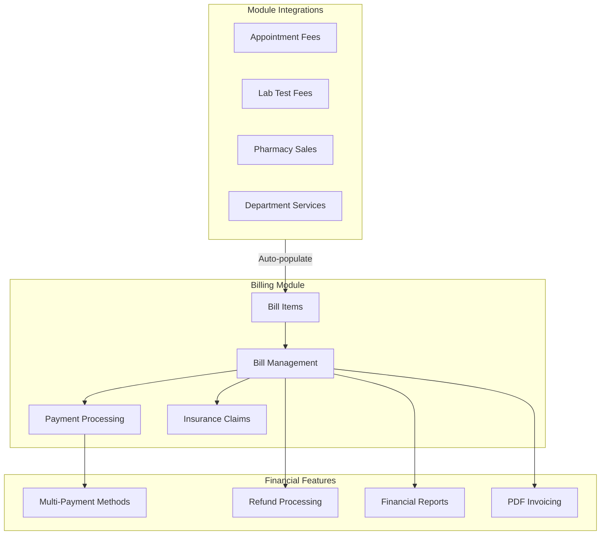

# Hospital Management System - Billing Module Architecture

## Executive Summary

This document outlines the comprehensive architecture for a full-featured billing system for the Hospital Management System (HMS). The billing module will integrate with all existing modules (Appointments, Laboratory, Pharmacy, Departments) and support insurance claims processing, multiple payment methods, and comprehensive reporting.

## Current State Analysis

### Existing Billing Structure
- **Models**: [`Bill`](app/Models/Bill.php), [`BillItem`](app/Models/BillItem.php)
- **Controller**: [`BillController`](app/Http/Controllers/Billing/BillController.php)
- **Pages**: Index, Create, Edit, Show (basic CRUD)
- **Database**: bills table, bill_items table

### Limitations of Current System
1. No insurance integration
2. No auto-population from other modules
3. Limited payment tracking (single amount_paid field)
4. No payment method breakdown
5. Basic reporting only
6. No refund/void workflow
7. No recurring billing support

---

## Proposed Architecture

### System Overview



---

## Database Schema Design

### New Tables

#### 1. Insurance Providers
```sql
insurance_providers
- id (PK)
- name
- code
- contact_info (JSON)
- coverage_types (JSON)
- is_active
- created_at/updated_at
```

#### 2. Patient Insurance
```sql
patient_insurances
- id (PK)
- patient_id (FK)
- insurance_provider_id (FK)
- policy_number
- policy_holder_name
- relationship_to_patient
- coverage_start_date
- coverage_end_date
- co_pay_amount
- co_pay_percentage
- is_primary
- is_active
- created_at/updated_at
```

#### 3. Bill Items (Enhanced)
```sql
bill_items
- id (PK)
- bill_id (FK)
- item_type (enum: appointment, lab_test, pharmacy, service, manual)
- source_id (polymorphic reference)
- item_description
- quantity
- unit_price
- discount_amount
- discount_percentage
- total_price
- created_at/updated_at
```

#### 4. Payments
```sql
payments
- id (PK)
- bill_id (FK)
- payment_method (enum: cash, card, insurance, bank_transfer, mobile_money)
- amount
- transaction_id
- payment_date
- received_by (FK to users)
- notes
- created_at/updated_at
```

#### 5. Insurance Claims
```sql
insurance_claims
- id (PK)
- bill_id (FK)
- patient_insurance_id (FK)
- claim_number
- claim_amount
- approved_amount
- status (pending, submitted, approved, rejected, partial)
- submission_date
- response_date
- rejection_reason
- documents (JSON)
- created_at/updated_at
```

#### 6. Bill Refunds
```sql
bill_refunds
- id (PK)
- bill_id (FK)
- payment_id (FK, nullable)
- refund_amount
- refund_reason
- refunded_by (FK to users)
- refund_date
- status (pending, approved, processed, rejected)
- approved_by (FK to users)
- notes
- created_at/updated_at
```

#### 7. Bill Status History
```sql
bill_status_history
- id (PK)
- bill_id (FK)
- status_from
- status_to
- changed_by (FK to users)
- reason
- created_at
```

### Enhanced Bills Table
Add columns to existing bills table:
```sql
- invoice_number (unique, for PDF generation)
- due_date
- billing_address (JSON)
- insurance_claim_id (FK, nullable)
- total_discount
- total_tax
- balance_due (calculated)
- last_payment_date
- reminder_sent_count
- reminder_last_sent
```

---

## Backend Architecture

### Model Relationships

```php
// Bill Model Relationships
bill -> hasMany(BillItem)
bill -> hasMany(Payment)
bill -> hasMany(InsuranceClaim)
bill -> hasMany(BillRefund)
bill -> hasMany(BillStatusHistory)
bill -> belongsTo(Patient)
bill -> belongsTo(Doctor, nullable)
bill -> belongsTo(User, 'created_by')

// New Models
InsuranceProvider -> hasMany(PatientInsurance)
PatientInsurance -> belongsTo(Patient)
PatientInsurance -> belongsTo(InsuranceProvider)
Payment -> belongsTo(Bill)
Payment -> belongsTo(User, 'received_by')
InsuranceClaim -> belongsTo(Bill)
InsuranceClaim -> belongsTo(PatientInsurance)
```

### Controllers

#### 1. Enhanced BillController
```
app/Http/Controllers/Billing/BillController.php
- index() - List bills with filters
- create() - Create bill with auto-population
- store() - Store new bill
- show() - View bill details
- edit() - Edit bill
- update() - Update bill
- destroy() - Delete bill
- generateInvoice() - Generate PDF invoice
- sendReminder() - Send payment reminder
- void() - Void a bill
```

#### 2. PaymentController
```
app/Http/Controllers/Billing/PaymentController.php
- index() - List payments for a bill
- store() - Record new payment
- show() - Payment details
- refund() - Process refund
- getPaymentMethods() - Available payment methods
```

#### 3. InsuranceClaimController
```
app/Http/Controllers/Billing/InsuranceClaimController.php
- index() - List claims
- store() - Submit new claim
- show() - Claim details
- update() - Update claim status
- submitToProvider() - Submit to insurance API
- getClaimStatus() - Check claim status
```

#### 4. InsuranceProviderController
```
app/Http/Controllers/Billing/InsuranceProviderController.php
- CRUD operations for insurance providers
```

#### 5. PatientInsuranceController
```
app/Http/Controllers/Billing/PatientInsuranceController.php
- CRUD for patient insurance records
```

#### 6. BillingReportController
```
app/Http/Controllers/Billing/BillingReportController.php
- revenueReport() - Revenue by period
- outstandingReport() - Outstanding payments
- paymentMethodReport() - Breakdown by method
- insuranceClaimReport() - Claims summary
- doctorRevenueReport() - Revenue by doctor
- departmentRevenueReport() - Revenue by department
```

### Services

#### 1. BillCalculationService
```php
app/Services/Billing/BillCalculationService.php
- calculateTotals(Bill $bill): array
- applyDiscount(Bill $bill, float $amount, string $type): void
- calculateTax(Bill $bill, float $rate): float
- updateBalanceDue(Bill $bill): void
```

#### 2. BillItemService
```php
app/Services/Billing/BillItemService.php
- addFromAppointment(Bill $bill, Appointment $appointment): BillItem
- addFromLabTest(Bill $bill, LabTestRequest $labTest): BillItem
- addFromPharmacySale(Bill $bill, Sale $sale): BillItem
- addFromDepartmentService(Bill $bill, DepartmentService $service): BillItem
- addManualItem(Bill $bill, array $data): BillItem
```

#### 3. InsuranceClaimService
```php
app/Services/Billing/InsuranceClaimService.php
- submitClaim(InsuranceClaim $claim): bool
- processResponse(InsuranceClaim $claim, array $response): void
- calculateCoverage(PatientInsurance $insurance, float $amount): array
```

#### 4. PaymentService
```php
app/Services/Billing/PaymentService.php
- processPayment(Bill $bill, array $paymentData): Payment
- processRefund(Payment $payment, float $amount, string $reason): BillRefund
- updateBillStatus(Bill $bill): void
```

#### 5. InvoiceGenerationService
```php
app/Services/Billing/InvoiceGenerationService.php
- generatePDF(Bill $bill): string (file path)
- generateInvoiceNumber(): string
- emailInvoice(Bill $bill, string $email): void
```

### Requests/Validation

```
app/Http/Requests/Billing/
- StoreBillRequest.php
- UpdateBillRequest.php
- StorePaymentRequest.php
- StoreInsuranceClaimRequest.php
- StorePatientInsuranceRequest.php
- ProcessRefundRequest.php
```

### Resources

```
app/Http/Resources/Billing/
- BillResource.php
- BillItemResource.php
- PaymentResource.php
- InsuranceClaimResource.php
- PatientInsuranceResource.php
- InsuranceProviderResource.php
```

---

## Frontend Architecture

### Page Structure

```
resources/js/Pages/Billing/
├── Index.tsx                 # Bills list with filters
├── Create.tsx                # Create new bill
├── Edit.tsx                  # Edit existing bill
├── Show.tsx                  # Bill details view
├── Invoice.tsx               # Invoice preview/print
├── Components/
│   ├── BillForm.tsx          # Shared form component
│   ├── BillItemTable.tsx     # Items table with CRUD
│   ├── PaymentSection.tsx    # Payments list & form
│   ├── InsuranceSection.tsx  # Insurance claims
│   ├── BillSummary.tsx       # Totals display
│   └── StatusBadge.tsx       # Status indicator
├── Payments/
│   ├── Index.tsx             # All payments list
│   └── Create.tsx            # Record payment
├── Insurance/
│   ├── Claims/
│   │   ├── Index.tsx
│   │   ├── Create.tsx
│   │   └── Show.tsx
│   └── Providers/
│       ├── Index.tsx
│       ├── Create.tsx
│       └── Edit.tsx
├── PatientInsurance/
│   ├── Index.tsx
│   ├── Create.tsx
│   └── Edit.tsx
└── Reports/
    ├── Revenue.tsx
    ├── Outstanding.tsx
    ├── PaymentMethods.tsx
    └── InsuranceClaims.tsx
```

### Components

#### 1. BillItemManager
- Add items from different sources
- Manual item entry
- Quantity/price editing
- Discount per item
- Real-time total calculation

#### 2. PaymentRecorder
- Payment method selection
- Amount entry
- Transaction ID input
- Multiple payment support
- Change calculation for cash

#### 3. InsuranceClaimForm
- Insurance selection
- Claim amount calculation
- Document upload
- Status tracking

#### 4. BillSummaryCard
- Subtotal display
- Discount summary
- Tax calculation
- Total amount
- Amount paid
- Balance due
- Payment status badge

#### 5. PatientInsuranceCard
- Insurance provider info
- Policy details
- Coverage info
- Validity dates

### Shared Components

```
resources/js/components/billing/
├── BillStatusBadge.tsx
├── PaymentMethodIcon.tsx
├── CurrencyDisplay.tsx
├── InvoiceTemplate.tsx
├── PaymentReminderDialog.tsx
├── RefundDialog.tsx
└── BillFilters.tsx
```

---

## UI/UX Design Specifications

### Color Scheme
- **Paid**: Green (emerald-500)
- **Partial**: Yellow (amber-500)
- **Pending**: Orange (orange-500)
- **Overdue**: Red (red-500)
- **Cancelled**: Gray (gray-400)
- **Insurance Pending**: Blue (blue-500)

### Bill List Page (Index)

**Layout:**
- Header with title, search, and "Create Bill" button
- Filter bar: Date range, Status, Payment method, Patient search
- Data table with columns:
  - Bill Number (clickable)
  - Patient (name + ID)
  - Date
  - Total Amount
  - Amount Paid
  - Balance Due
  - Status (badge)
  - Actions (view, edit, invoice)

**Features:**
- Bulk actions (export, print)
- Quick filters (Today, This Week, Overdue)
- Pagination
- Sortable columns

### Create/Edit Bill Page

**Layout (3-column on desktop):**
```
| Left (25%)       | Center (50%)           | Right (25%)      |
|------------------|------------------------|------------------|
| Patient Info     | Bill Items Table       | Bill Summary     |
| Insurance Info   | - Add Item buttons     | - Subtotal       |
| Doctor Info      | - Item rows            | - Discount       |
|                  | - Quantity/Price edit  | - Tax            |
|                  |                        | - Total          |
|                  |                        | - Paid           |
|                  |                        | - Balance        |
|                  |                        | - Pay Button     |
```

**Add Item Options:**
- From Appointment (dropdown of patient's appointments)
- From Lab Tests (dropdown of pending lab tests)
- From Pharmacy (search medicines)
- From Department Services (dropdown)
- Manual Entry (description, quantity, price)

### Bill Detail Page (Show)

**Sections:**
1. **Header**: Bill number, date, status badge, action buttons (Edit, Print, Send)
2. **Patient Card**: Photo, name, ID, contact, insurance info
3. **Bill Items Table**: All items with source indicators
4. **Payments Section**: List of all payments with method icons
5. **Insurance Section**: Claim details if applicable
6. **Activity Log**: Status changes, payments, refunds

### Payment Modal

**Fields:**
- Payment Method (Cash, Card, Insurance, Bank Transfer, Mobile Money)
- Amount (auto-filled with balance due)
- Transaction ID (for non-cash)
- Notes
- Received By (auto-filled with current user)

**Cash Payment:**
- Amount Tendered field
- Change Due calculation

### Invoice Template

**Header:**
- Hospital logo and info
- Invoice number and date
- Bill number reference

**Patient Info:**
- Name, ID, Address
- Insurance info (if applicable)

**Table:**
- Item description
- Quantity
- Unit price
- Discount
- Total

**Summary:**
- Subtotal
- Discount total
- Tax
- Total
- Amount paid
- Balance due

**Footer:**
- Payment terms
- Bank details
- QR code for online payment

---

## Integration Points

### 1. Appointments Module
**Trigger:** Appointment completed
**Action:** Auto-create bill item for consultation fee
**Code Location:** AppointmentController@update (when status changed to completed)

### 2. Laboratory Module
**Trigger:** Lab test marked as completed
**Action:** Add lab test fee to patient's open bill or create new bill
**Code Location:** LabTestResultController@store

### 3. Pharmacy Module
**Trigger:** Sale completed
**Action:** Add pharmacy items to bill if not already paid
**Code Location:** SalesController@store

### 4. Department Services
**Trigger:** Service rendered
**Action:** Add service fee to bill
**Code Location:** DepartmentServiceController usage

### 5. Patient Module
**Integration:** Show billing history on patient profile
**Code Location:** PatientController@show

---

## Reports & Analytics

### 1. Revenue Report
- Daily/Weekly/Monthly/Custom date range
- Group by: Day, Week, Month, Year
- Metrics: Total revenue, Discounts, Tax collected
- Charts: Line chart for trends

### 2. Outstanding Payments Report
- Aging buckets: 0-30, 31-60, 61-90, 90+ days
- Patient list with outstanding amounts
- Total overdue amount

### 3. Payment Method Report
- Breakdown by: Cash, Card, Insurance, Bank Transfer
- Percentage distribution
- Trend over time

### 4. Insurance Claims Report
- Claims by status
- Average processing time
- Approved vs Rejected ratio
- Top insurance providers

### 5. Doctor Revenue Report
- Revenue by doctor
- Number of bills
- Average bill amount

### 6. Department Revenue Report
- Revenue by department
- Service utilization

---

## Security & Permissions

### Permission Structure
```
billing.view        - View bills
billing.create      - Create new bills
billing.edit        - Edit existing bills
billing.delete      - Delete bills
billing.payment     - Record payments
billing.refund      - Process refunds
billing.insurance   - Manage insurance claims
billing.reports     - View billing reports
billing.settings    - Configure billing settings
```

### Audit Trail
- All payment transactions logged
- Bill status changes tracked
- Refund approvals logged
- Insurance claim status changes recorded

---

## Implementation Phases

### Phase 1: Core Enhancement (Week 1-2)
- [ ] Enhance Bill and BillItem models
- [ ] Create Payment model and migration
- [ ] Update BillController with payment tracking
- [ ] Redesign Create/Edit bill pages
- [ ] Add PaymentSection component

### Phase 2: Insurance Integration (Week 3-4)
- [ ] Create InsuranceProvider model
- [ ] Create PatientInsurance model
- [ ] Create InsuranceClaim model
- [ ] Build Insurance controllers
- [ ] Create insurance UI components

### Phase 3: Module Integration (Week 5-6)
- [ ] Integrate with Appointments
- [ ] Integrate with Laboratory
- [ ] Integrate with Pharmacy
- [ ] Integrate with Department Services
- [ ] Build BillItemService

### Phase 4: Advanced Features (Week 7-8)
- [ ] Invoice PDF generation
- [ ] Email notifications
- [ ] Refund processing
- [ ] Payment reminders
- [ ] Bill status history

### Phase 5: Reporting (Week 9-10)
- [ ] Revenue reports
- [ ] Outstanding payments report
- [ ] Payment method breakdown
- [ ] Insurance claims report
- [ ] Export to Excel/PDF

### Phase 6: Testing & Optimization (Week 11-12)
- [ ] Unit tests for services
- [ ] Feature tests for controllers
- [ ] Frontend component tests
- [ ] Performance optimization
- [ ] Security audit

---

## API Endpoints

### Bills
```
GET    /api/billing              - List bills
POST   /api/billing              - Create bill
GET    /api/billing/{id}         - Get bill details
PUT    /api/billing/{id}         - Update bill
DELETE /api/billing/{id}         - Delete bill
POST   /api/billing/{id}/void    - Void bill
GET    /api/billing/{id}/invoice - Generate invoice PDF
```

### Payments
```
GET    /api/billing/{id}/payments     - List payments
POST   /api/billing/{id}/payments     - Record payment
GET    /api/payments/{paymentId}      - Payment details
POST   /api/payments/{id}/refund      - Process refund
```

### Insurance
```
GET    /api/insurance/providers       - List providers
POST   /api/insurance/providers       - Create provider
GET    /api/patients/{id}/insurance   - List patient insurance
POST   /api/patients/{id}/insurance   - Add insurance
GET    /api/billing/{id}/claims       - List claims
POST   /api/billing/{id}/claims       - Submit claim
PUT    /api/claims/{id}               - Update claim
```

### Reports
```
GET    /api/reports/billing/revenue          - Revenue report
GET    /api/reports/billing/outstanding      - Outstanding report
GET    /api/reports/billing/payment-methods  - Payment methods
GET    /api/reports/billing/insurance        - Insurance claims
GET    /api/reports/billing/doctors          - Doctor revenue
GET    /api/reports/billing/departments      - Department revenue
```

---

## Configuration

### Billing Settings (config/billing.php)
```php
return [
    'currency' => env('BILLING_CURRENCY', 'USD'),
    'currency_symbol' => env('BILLING_CURRENCY_SYMBOL', '$'),
    'tax_rate' => env('BILLING_TAX_RATE', 0),
    'invoice_prefix' => env('BILLING_INVOICE_PREFIX', 'INV-'),
    'payment_methods' => [
        'cash' => ['label' => 'Cash', 'icon' => 'Banknote'],
        'card' => ['label' => 'Credit/Debit Card', 'icon' => 'CreditCard'],
        'insurance' => ['label' => 'Insurance', 'icon' => 'Shield'],
        'bank_transfer' => ['label' => 'Bank Transfer', 'icon' => 'BuildingBank'],
        'mobile_money' => ['label' => 'Mobile Money', 'icon' => 'Smartphone'],
    ],
    'reminder_days' => [3, 7, 14], // Days before due date
    'overdue_interest_rate' => 0, // Percentage per month
];
```

---

## Future Enhancements

1. **Online Payments**: Integration with Stripe, PayPal
2. **Recurring Billing**: Subscription-based services
3. **Multi-Currency**: Support for different currencies
4. **Advanced Analytics**: ML-based revenue prediction
5. **Patient Portal**: Online bill viewing and payment
6. **SMS Integration**: Payment reminders via SMS
7. **API for Insurance**: Direct integration with insurance providers
8. **Automated Claims**: Auto-submit claims to insurance

---

## Appendix

### A. Database Migration Summary

| Migration | Purpose |
|-----------|---------|
| enhance_bills_table | Add new columns to bills |
| enhance_bill_items_table | Add item_type and source_id |
| create_insurance_providers_table | Insurance companies |
| create_patient_insurances_table | Patient policies |
| create_payments_table | Payment records |
| create_insurance_claims_table | Claim tracking |
| create_bill_refunds_table | Refund records |
| create_bill_status_history_table | Audit trail |

### B. Environment Variables

```env
BILLING_CURRENCY=USD
BILLING_CURRENCY_SYMBOL=$
BILLING_TAX_RATE=0
BILLING_INVOICE_PREFIX=INV-
BILLING_PDF_ENABLED=true
BILLING_EMAIL_ENABLED=true
```

---

*Document Version: 1.0*
*Last Updated: 2026-02-01*
*Author: HMS Architecture Team*
