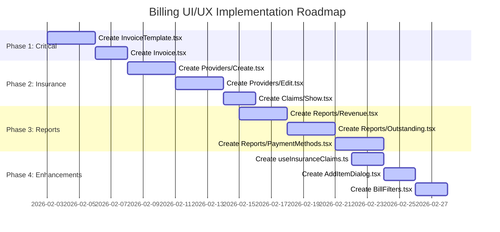

# Billing System UI/UX Audit Report

**Audit Date:** February 2, 2026  
**Report Version:** 1.0  
**Auditor:** Architect Mode Analysis  

---

## Executive Summary

This audit identifies gaps between the planned UI/UX design specifications and the current front-end implementation of the billing system. The audit covers pages, components, hooks, and type definitions as documented in the billing system plans.

**Overall Implementation Status:** ~65% Complete

| Category | Status | Details |
|----------|--------|---------|
| Core Billing Pages | ✅ Complete | Index, Create, Edit, Show pages exist and are functional |
| Insurance Pages | ⚠️ Partial | Claims/Providers Index complete, missing Create/Edit forms |
| Payment Pages | ⚠️ Partial | Index complete, missing standalone Create page |
| Report Pages | ❌ Missing | Only Index page exists, no detailed report views |
| Shared Components | ⚠️ Partial | 4 of 8 planned components exist |
| Custom Hooks | ⚠️ Partial | 2 of 3 planned hooks exist |
| Patient Insurance Pages | ❌ Missing | No dedicated patient insurance management pages |

---

## Detailed Findings

### 1. Page Implementation Status

#### 1.1 Core Billing Pages ✅ COMPLETE

| Page | File Path | Status | Notes |
|------|-----------|--------|-------|
| Bill List | [`resources/js/Pages/Billing/Index.tsx`](resources/js/Pages/Billing/Index.tsx) | ✅ Complete | Full-featured with filters, pagination, statistics |
| Create Bill | [`resources/js/Pages/Billing/Create.tsx`](resources/js/Pages/Billing/Create.tsx) | ✅ Complete | Comprehensive form with item management |
| Edit Bill | [`resources/js/Pages/Billing/Edit.tsx`](resources/js/Pages/Billing/Edit.tsx) | ✅ Complete | Basic edit functionality |
| Bill Details | [`resources/js/Pages/Billing/Show.tsx`](resources/js/Pages/Billing/Show.tsx) | ✅ Complete | Detailed bill view with payment info |
| Invoice View | `resources/js/Pages/Billing/Invoice.tsx` | ❌ Missing | PDF invoice preview/print page not implemented |

**Gap 1.1.1: Invoice View Page Missing**
- **Severity:** High
- **Description:** No dedicated invoice page exists for viewing/printing PDF invoices
- **Route:** `/billing/{bill}/invoice` exists in routes but page not implemented
- **Recommendation:** Create [`Invoice.tsx`](resources/js/Pages/Billing/Invoice.tsx) using the [`InvoiceTemplate`](resources/js/components/billing/InvoiceTemplate.tsx) component

#### 1.2 Insurance Pages ⚠️ PARTIAL

| Page | File Path | Status | Notes |
|------|-----------|--------|-------|
| Claims Index | [`resources/js/Pages/Billing/Insurance/Claims/Index.tsx`](resources/js/Pages/Billing/Insurance/Claims/Index.tsx) | ✅ Complete | Full-featured claims management |
| Claims Create | `resources/js/Pages/Billing/Insurance/Claims/Create.tsx` | ❌ Missing | No standalone claim creation page |
| Claims Show | `resources/js/Pages/Billing/Insurance/Claims/Show.tsx` | ❌ Missing | No detailed claim view page |
| Providers Index | [`resources/js/Pages/Billing/Insurance/Providers/Index.tsx`](resources/js/Pages/Billing/Insurance/Providers/Index.tsx) | ✅ Complete | Provider list with details dialog |
| Providers Create | `resources/js/Pages/Billing/Insurance/Providers/Create.tsx` | ❌ Missing | No provider creation form |
| Providers Edit | `resources/js/Pages/Billing/Insurance/Providers/Edit.tsx` | ❌ Missing | No provider edit form |

**Gap 1.2.1: Insurance Claims Create Page Missing**
- **Severity:** Medium
- **Description:** Claims can only be created from bill view, no standalone page
- **Route:** `/insurance/claims/create` not defined
- **Recommendation:** Create [`Claims/Create.tsx`](resources/js/Pages/Billing/Insurance/Claims/Create.tsx) for bulk claim creation

**Gap 1.2.2: Insurance Providers CRUD Pages Missing**
- **Severity:** High
- **Description:** Providers can only be viewed, no create/edit functionality
- **Routes:** `/insurance/providers/create`, `/insurance/providers/{id}/edit` not defined
- **Recommendation:** Create [`Providers/Create.tsx`](resources/js/Pages/Billing/Insurance/Providers/Create.tsx) and [`Providers/Edit.tsx`](resources/js/Pages/Billing/Insurance/Providers/Edit.tsx)

#### 1.3 Payment Pages ⚠️ PARTIAL

| Page | File Path | Status | Notes |
|------|-----------|--------|-------|
| Payments Index | [`resources/js/Pages/Billing/Payments/Index.tsx`](resources/js/Pages/Billing/Payments/Index.tsx) | ✅ Complete | Full payment history with filters |
| Payment Create | `resources/js/Pages/Billing/Payments/Create.tsx` | ❌ Missing | No standalone payment recording page |

**Gap 1.3.1: Standalone Payment Create Page Missing**
- **Severity:** Low
- **Description:** Payments are recorded from bill view, no global payment creation
- **Route:** `/payments/create` not defined
- **Recommendation:** Consider if needed based on workflow requirements

#### 1.4 Billing Reports Pages ❌ MISSING

| Page | File Path | Status | Notes |
|------|-----------|--------|-------|
| Reports Index | [`resources/js/Pages/Billing/Reports/Index.tsx`](resources/js/Pages/Billing/Reports/Index.tsx) | ✅ Complete | Navigation hub with report categories |
| Revenue Report | `resources/js/Pages/Billing/Reports/Revenue.tsx` | ❌ Missing | No detailed revenue report view |
| Outstanding Report | `resources/js/Pages/Billing/Reports/Outstanding.tsx` | ❌ Missing | No outstanding payments report |
| Payment Methods Report | `resources/js/Pages/Billing/Reports/PaymentMethods.tsx` | ❌ Missing | No payment breakdown report |
| Insurance Claims Report | `resources/js/Pages/Billing/Reports/InsuranceClaims.tsx` | ❌ Missing | No claims analytics report |

**Gap 1.4.1: Report Detail Pages Missing**
- **Severity:** High
- **Description:** Reports Index page provides links to detailed reports that don't exist
- **Routes:** Multiple `/reports/billing/*` routes exist but pages not implemented
- **Routes Defined:**
  - `/reports/billing/revenue`
  - `/reports/billing/outstanding`
  - `/reports/billing/payment-methods`
  - `/reports/billing/insurance-claims`
  - `/reports/billing/transactions`
  - `/reports/billing/department-revenue`
  - `/reports/billing/payment-trends`
  - `/reports/billing/collections`
  - `/reports/billing/overdue`
  - `/reports/billing/refunds`
  - `/reports/billing/provider-performance`
  - `/reports/billing/pending-claims`

- **Recommendation:** Create at minimum the core reports:
  - [`Reports/Revenue.tsx`](resources/js/Pages/Billing/Reports/Revenue.tsx)
  - [`Reports/Outstanding.tsx`](resources/js/Pages/Billing/Reports/Outstanding.tsx)
  - [`Reports/PaymentMethods.tsx`](resources/js/Pages/Billing/Reports/PaymentMethods.tsx)
  - [`Reports/InsuranceClaims.tsx`](resources/js/Pages/Billing/Reports/InsuranceClaims.tsx)

#### 1.5 Patient Insurance Pages ❌ MISSING

| Page | File Path | Status | Notes |
|------|-----------|--------|-------|
| Patient Insurance Index | `resources/js/Pages/Billing/PatientInsurance/Index.tsx` | ❌ Missing | No dedicated patient insurance list |
| Patient Insurance Create | `resources/js/Pages/Billing/PatientInsurance/Create.tsx` | ❌ Missing | No form for adding patient insurance |
| Patient Insurance Edit | `resources/js/Pages/Billing/PatientInsurance/Edit.tsx` | ❌ Missing | No edit form for patient insurance |

**Gap 1.5.1: Patient Insurance Management Pages Missing**
- **Severity:** Medium
- **Description:** Patient insurance is managed per-patient, no centralized management
- **Note:** Current implementation requires navigating to each patient to manage insurance
- **Recommendation:** Create centralized patient insurance management pages for admin use

---

### 2. Shared Components Status

#### 2.1 Existing Components ✅

| Component | File Path | Status | Notes |
|-----------|-----------|--------|-------|
| Bill Status Badge | [`resources/js/components/billing/BillStatusBadge.tsx`](resources/js/components/billing/BillStatusBadge.tsx) | ✅ Complete | Status badges with color coding |
| Currency Display | [`resources/js/components/billing/CurrencyDisplay.tsx`](resources/js/components/billing/CurrencyDisplay.tsx) | ✅ Complete | Consistent currency formatting |
| Payment Method Icon | [`resources/js/components/billing/PaymentMethodIcon.tsx`](resources/js/components/billing/PaymentMethodIcon.tsx) | ✅ Complete | Icons for payment types |
| Bill Summary | [`resources/js/components/billing/BillSummary.tsx`](resources/js/components/billing/BillSummary.tsx) | ✅ Complete | Summary card for bills |

#### 2.2 Missing Components ❌

| Component | Planned Path | Severity | Description |
|-----------|--------------|----------|-------------|
| Invoice Template | `resources/js/components/billing/InvoiceTemplate.tsx` | High | PDF template for invoice generation |
| Payment Dialog | `resources/js/components/billing/PaymentDialog.tsx` | Medium | Modal for quick payment recording |
| Refund Dialog | `resources/js/components/billing/RefundDialog.tsx` | Medium | Modal for refund processing |
| Bill Filters | `resources/js/components/billing/BillFilters.tsx` | Low | Reusable filter component |
| Add Item Dialog | `resources/js/components/billing/AddItemDialog.tsx` | Medium | Modal for adding bill items |
| Insurance Claim Dialog | `resources/js/components/billing/InsuranceClaimDialog.tsx` | Medium | Modal for quick claim submission |

**Gap 2.1: InvoiceTemplate Component Missing**
- **Severity:** High
- **Impact:** Prevents PDF invoice generation
- **Recommendation:** Create [`InvoiceTemplate.tsx`](resources/js/components/billing/InvoiceTemplate.tsx) based on specifications in [`plans/billing-component-specifications.md`](plans/billing-component-specifications.md)

---

### 3. Custom Hooks Status

#### 3.1 Existing Hooks ✅

| Hook | File Path | Status | Notes |
|------|-----------|--------|-------|
| useBillCalculations | [`resources/js/hooks/billing/useBillCalculations.ts`](resources/js/hooks/billing/useBillCalculations.ts) | ✅ Complete | Handles all bill calculations |
| usePaymentProcessing | [`resources/js/hooks/billing/usePaymentProcessing.ts`](resources/js/hooks/billing/usePaymentProcessing.ts) | ✅ Complete | Payment form handling |

#### 3.2 Missing Hooks ❌

| Hook | Planned Path | Severity | Description |
|------|--------------|----------|-------------|
| useInsuranceClaims | `resources/js/hooks/billing/useInsuranceClaims.ts` | Medium | Claim form handling and submission |

**Gap 3.1: useInsuranceClaims Hook Missing**
- **Severity:** Medium
- **Impact:** Insurance claim forms lack consistent state management
- **Recommendation:** Create [`useInsuranceClaims.ts`](resources/js/hooks/billing/useInsuranceClaims.ts) for claim processing

---

### 4. Type Definitions Status

#### 4.1 Existing Types ✅

| Type File | File Path | Status | Notes |
|-----------|-----------|--------|-------|
| Billing Types | [`resources/js/types/billing.ts`](resources/js/types/billing.ts) | ✅ Complete | Comprehensive type definitions |

**Status:** All planned types are defined in [`billing.ts`](resources/js/types/billing.ts):
- Enums: BillStatus, PaymentStatus, PaymentMethod, ItemType, ClaimStatus, RefundStatus
- Interfaces: Patient, Doctor, Bill, BillItem, Payment, InsuranceProvider, PatientInsurance, InsuranceClaim, BillRefund, BillStatusHistory
- Form Data Types: BillFormData, BillItemFormData, PaymentFormData, InsuranceClaimFormData
- Filter Types: BillFilters
- Report Types: RevenueReportData

---

## Component Architecture Analysis

### Current Component Hierarchy

```
resources/js/
├── Pages/
│   └── Billing/
│       ├── Index.tsx                    ✅ Complete
│       ├── Create.tsx                   ✅ Complete
│       ├── Edit.tsx                     ✅ Complete
│       ├── Show.tsx                     ✅ Complete
│       ├── Invoice.tsx                  ❌ Missing
│       ├── Components/
│       │   ├── BillForm.tsx             ⚠️ Inline in Create.tsx
│       │   ├── BillItemManager.tsx      ✅ Complete
│       │   ├── BillSummary.tsx          ✅ Complete
│       │   ├── PaymentSection.tsx       ✅ Complete
│       │   ├── InsuranceSection.tsx     ✅ Complete
│       │   └── StatusBadge.tsx          ✅ Complete (BillStatusBadge)
│       ├── Payments/
│       │   ├── Index.tsx                ✅ Complete
│       │   └── Create.tsx               ❌ Missing
│       ├── Insurance/
│       │   ├── Claims/
│       │   │   ├── Index.tsx            ✅ Complete
│       │   │   ├── Create.tsx           ❌ Missing
│       │   │   └── Show.tsx             ❌ Missing
│       │   └── Providers/
│       │       ├── Index.tsx            ✅ Complete
│       │       ├── Create.tsx           ❌ Missing
│       │       └── Edit.tsx             ❌ Missing
│       └── Reports/
│           ├── Index.tsx                ✅ Complete
│           ├── Revenue.tsx              ❌ Missing
│           ├── Outstanding.tsx          ❌ Missing
│           ├── PaymentMethods.tsx       ❌ Missing
│           └── InsuranceClaims.tsx      ❌ Missing
└── components/
    └── billing/
        ├── BillStatusBadge.tsx          ✅ Complete
        ├── BillSummary.tsx              ✅ Complete
        ├── CurrencyDisplay.tsx          ✅ Complete
        ├── PaymentMethodIcon.tsx        ✅ Complete
        ├── InvoiceTemplate.tsx          ❌ Missing
        ├── PaymentDialog.tsx            ❌ Missing
        ├── RefundDialog.tsx             ❌ Missing
        ├── BillFilters.tsx              ❌ Missing
        ├── AddItemDialog.tsx            ❌ Missing
        └── InsuranceClaimDialog.tsx     ❌ Missing
```

---

## Recommendations

### Priority 1: Critical Gaps (High Impact)

1. **Create Invoice View Page**
   - File: `resources/js/Pages/Billing/Invoice.tsx`
   - Use existing `InvoiceTemplate` component (needs creation)
   - Enable PDF generation for bills

2. **Create InvoiceTemplate Component**
   - File: `resources/js/components/billing/InvoiceTemplate.tsx`
   - Standardized invoice layout for PDF generation
   - Includes hospital branding, bill details, itemized list

3. **Complete Insurance Providers CRUD**
   - Create `Providers/Create.tsx`
   - Create `Providers/Edit.tsx`
   - Enable full insurance provider management

### Priority 2: Important Gaps (Medium Impact)

4. **Complete Report Pages**
   - Create `Reports/Revenue.tsx`
   - Create `Reports/Outstanding.tsx`
   - Create `Reports/PaymentMethods.tsx`
   - Create `Reports/InsuranceClaims.tsx`

5. **Create Insurance Claims Detail Page**
   - File: `resources/js/Pages/Billing/Insurance/Claims/Show.tsx`
   - Detailed claim view with status timeline

6. **Create useInsuranceClaims Hook**
   - File: `resources/js/hooks/billing/useInsuranceClaims.ts`
   - Standardize claim form handling

### Priority 3: Enhancement Gaps (Low Impact)

7. **Create AddItemDialog Component**
   - Reusable modal for adding bill items from various sources

8. **Create BillFilters Component**
   - Reusable filter controls for billing pages

9. **Create Insurance Claim Create Page**
   - File: `resources/js/Pages/Billing/Insurance/Claims/Create.tsx`
   - Bulk claim creation capability

---

## Implementation Roadmap



---

## Summary Statistics

| Metric | Count | Percentage |
|--------|-------|------------|
| Total Planned Pages | 26 | 100% |
| Pages Implemented | 11 | 42% |
| Pages Partially Implemented | 4 | 15% |
| Pages Missing | 11 | 42% |
| Total Planned Components | 8 | 100% |
| Components Implemented | 4 | 50% |
| Components Missing | 4 | 50% |
| Total Planned Hooks | 3 | 100% |
| Hooks Implemented | 2 | 67% |
| Hooks Missing | 1 | 33% |
| Type Definitions | - | 100% Complete |

---

## Conclusion

The billing system has a solid foundation with core functionality implemented. However, to achieve full feature parity with the planned design, the following key areas need attention:

1. **Invoice Generation** - Critical for billing operations
2. **Insurance Provider Management** - Essential for insurance workflow
3. **Report Detail Pages** - Needed for financial analytics
4. **Dialog Components** - Improve user experience for quick actions

The estimated effort to complete all missing items is approximately 3-4 weeks of development time.

---

*Report generated based on analysis of:*
- [`plans/billing-system-architecture.md`](plans/billing-system-architecture.md)
- [`plans/billing-component-specifications.md`](plans/billing-component-specifications.md)
- [`plans/billing-implementation-summary.md`](plans/billing-implementation-summary.md)
- Current implementation in [`resources/js/Pages/Billing/`](resources/js/Pages/Billing/)
