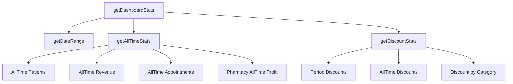

# Hospital Dashboard Analytics Implementation Plan

## Executive Summary

This plan outlines the implementation of a comprehensive analytics section for the Hospital Management System dashboard. The implementation will replace the "Recent System Activities" (Admin Activity) section with multi-period analytics displaying real-time statistics across all hospital resources.

---

## 1. Current State Analysis

### 1.1 Existing Dashboard Structure

| Section | Location | Status |
|---------|----------|--------|
| Revenue Cards | Lines 334-363 | 3 cards: Total, Appointment, Pharmacy |
| Key Metrics | Lines 368-401 | 3 cards: Patients, Doctors, Appointments |
| Department Status | Lines 404-438 | 4 cards: Pharmacy, Laboratory, Today's Appointments, Departments |
| Alerts & Notifications | Lines 441-483 | Stock alerts |
| Admin Activity (Super Admins) | Lines 486-562 | Activity Log + Admin Users |

### 1.2 Backend Data Structure

| Service Method | Current Data | Required Enhancement |
|----------------|--------------|----------------------|
| `getSummaryStats()` | Period-based totals | Add all-time totals |
| `getPatientStats()` | Period-based | Add all-time + today's new patients |
| `getAppointmentStats()` | Period-based | Add today's count/revenue |
| `getFinancialStats()` | Revenue breakdown | Add profit calculations, discount tracking |
| `getPharmacyStats()` | Revenue, stock alerts | Add profit (not just revenue), all-time totals |

---

## 2. Implementation Plan

### 2.1 Backend Changes

#### 2.1.1 DashboardService Enhancements

**File:** `app/Services/DashboardService.php`



**Required Methods:**

| Method | Purpose | Output |
|--------|---------|--------|
| `getAllTimeStats()` | Get cumulative totals | Patients, Appointments, Revenue, Pharmacy Sales |
| `getDiscountStats()` | Track all discounts | Period-based and all-time discount totals |
| `getPharmacyProfit()` | Calculate actual profit | Revenue - Cost of Goods Sold |
| `getPeriodComparison()` | Compare periods | Today vs Yesterday, Month vs Last Month |

#### 2.1.2 New Backend Methods to Add

```php
// In DashboardService.php

/**
 * Get all-time cumulative statistics
 */
protected function getAllTimeStats(): array
{
    return [
        'total_patients_all_time' => Patient::count(),
        'total_appointments_all_time' => Appointment::count(),
        'total_revenue_all_time' => $this->calculateTotalRevenue(),
        'pharmacy_profit_all_time' => $this->calculatePharmacyProfit(),
        'total_discounts_all_time' => $this->calculateTotalDiscounts(),
    ];
}

/**
 * Get discount statistics
 */
protected function getDiscountStats(array $dateRange): array
{
    // Appointment discounts
    $appointmentDiscounts = Appointment::whereBetween('appointment_date', $dateRange)
        ->sum(DB::raw('COALESCE(discount, 0) + COALESCE(discount_fixed, 0)'));
    
    // Pharmacy discounts
    $pharmacyDiscounts = Sale::whereBetween('created_at', $dateRange)
        ->where('status', 'completed')
        ->sum('discount');
    
    // Service discounts
    $serviceDiscounts = DB::table('appointment_services')
        ->whereBetween('created_at', $dateRange)
        ->sum(DB::raw('custom_cost * (discount_percentage / 100)'));
    
    return [
        'period_appointment_discounts' => $appointmentDiscounts,
        'period_pharmacy_discounts' => $pharmacyDiscounts,
        'period_service_discounts' => $serviceDiscounts,
        'period_total_discounts' => $appointmentDiscounts + $pharmacyDiscounts + $serviceDiscounts,
    ];
}

/**
 * Calculate pharmacy profit (revenue - cost)
 */
protected function getPharmacyProfit(array $dateRange): array
{
    $revenue = Sale::whereBetween('created_at', $dateRange)
        ->where('status', 'completed')
        ->sum('grand_total');
    
    $cost = DB::table('sales_items')
        ->join('sales', 'sales_items.sale_id', '=', 'sales.id')
        ->join('medicines', 'sales_items.medicine_id', '=', 'medicines.id')
        ->whereBetween('sales.created_at', $dateRange)
        ->where('sales.status', 'completed')
        ->sum(DB::raw('sales_items.quantity * medicines.cost_price'));
    
    return [
        'revenue' => $revenue,
        'cost' => $cost,
        'profit' => $revenue - $cost,
        'profit_margin' => $revenue > 0 ? (($revenue - $cost) / $revenue) * 100 : 0,
    ];
}
```

#### 2.1.3 Controller Updates

**File:** `app/Http/Controllers/Dashboard/DashboardController.php`

- Add `allTime` period option to support all-time data requests
- Merge `getAllTimeStats()` results into main response
- Add `discount_stats` to the response

```php
// Update getDashboardStats call to include all-time data
$dashboardData = $this->dashboardService->getDashboardStats($period);
$dashboardData['all_time'] = $this->dashboardService->getAllTimeStats();
$dashboardData['discount_stats'] = $this->discountService->getDiscountSummary();
```

---

### 2.2 Frontend Changes

#### 2.2.1 Dashboard.tsx Structure

**New Layout:**

```
┌─────────────────────────────────────────────────────────────┐
│  HEADER: Title + Period Selector + Refresh Button         │
├─────────────────────────────────────────────────────────────┤
│  REVENUE OVERVIEW (4 cards)                                │
│  ┌──────────┐ ┌──────────┐ ┌──────────┐ ┌──────────┐       │
│  │  Total   │ │ Appt     │ │ Pharmacy │ │ Discount │       │
│  │ Revenue  │ │ Revenue  │ │ Profit   │ │ Applied  │       │
│  └──────────┘ └──────────┘ └──────────┘ └──────────┘       │
├─────────────────────────────────────────────────────────────┤
│  PHARMACY ANALYTICS                                        │
│  ┌────────────────────────┐ ┌────────────────────────┐     │
│  │ Today's Profit         │ │ All-Time Profit       │     │
│  │ (with trend)           │ │                        │     │
│  └────────────────────────┘ └────────────────────────┘     │
│  ┌────────────────────────┐ ┌────────────────────────┐     │
│  │ Stock Levels           │ │ Low Stock Alerts       │     │
│  │ (total medicines)      │ │ (count with badge)     │     │
│  └────────────────────────┘ └────────────────────────┘     │
├─────────────────────────────────────────────────────────────┤
│  APPOINTMENTS ANALYTICS                                    │
│  ┌────────────────────────┐ ┌────────────────────────┐     │
│  │ Today's Appointments   │ │ Today's Revenue        │     │
│  │ (count + schedule)     │ │                        │     │
│  └────────────────────────┘ └────────────────────────┘     │
│  ┌────────────────────────┐ ┌────────────────────────┐     │
│  │ Patients Registered    │ │ Today's New Patients   │     │
│  │ (All-Time)             │ │                        │     │
│  └────────────────────────┘ └────────────────────────┘     │
├─────────────────────────────────────────────────────────────┤
│  ALERTS & NOTIFICATIONS (Stock alerts remain)             │
└─────────────────────────────────────────────────────────────┘
```

#### 2.2.2 New TypeScript Interfaces

```typescript
// New types to add to Dashboard.tsx

interface PeriodSelectorProps {
  currentPeriod: 'today' | 'month' | 'year' | 'all_time';
  onPeriodChange: (period: string) => void;
}

interface AnalyticsCardProps {
  title: string;
  value: string | number;
  comparison?: {
    value: number;
    label: string;
    isPositive: boolean;
  };
  icon: React.ReactNode;
  bgColor: string;
  onClick?: () => void;
}

interface PharmacyAnalyticsProps {
  todayProfit: number;
  allTimeProfit: number;
  stockLevels: {
    total: number;
    lowStock: number;
    expiring: number;
    expired: number;
  };
}

interface AppointmentAnalyticsProps {
  today: {
    count: number;
    revenue: number;
    newPatients: number;
  };
  allTime: {
    totalPatients: number;
    totalAppointments: number;
  };
}

interface DiscountAnalyticsProps {
  period: {
    appointment: number;
    pharmacy: number;
    services: number;
    total: number;
  };
  allTime: {
    total: number;
  };
}
```

#### 2.2.3 Component Modifications

**1. Remove Admin Activity Section (Lines 486-562)**

```typescript
// DELETE these components:
// - Admin Activity Card (lines 489-523)
// - Admin Users Card (lines 526-561)
```

**2. Add Period Selector**

```typescript
const PeriodSelector = ({ 
  currentPeriod, 
  onChange 
}: PeriodSelectorProps) => (
  <div className="flex gap-2">
    {['today', 'month', 'year', 'all_time'].map((period) => (
      <Button
        key={period}
        variant={currentPeriod === period ? 'default' : 'outline'}
        onClick={() => onChange(period)}
        className="text-sm"
      >
        {period === 'all_time' ? 'All Time' : period.charAt(0).toUpperCase() + period.slice(1)}
      </Button>
    ))}
  </div>
);
```

**3. New AnalyticsCard Component**

```typescript
const AnalyticsCard = ({ 
  title, 
  value, 
  comparison, 
  icon, 
  bgColor, 
  onClick 
}: AnalyticsCardProps) => (
  <Card className={onClick ? 'cursor-pointer hover:shadow-lg transition-shadow' : ''} onClick={onClick}>
    <CardHeader className="flex flex-row items-center justify-between pb-2">
      <CardTitle className="text-sm font-medium text-muted-foreground">{title}</CardTitle>
      <div className={`p-2 rounded-full ${bgColor}`}>
        {icon}
      </div>
    </CardHeader>
    <CardContent>
      <div className="text-2xl font-bold">{value}</div>
      {comparison && (
        <div className="flex items-center text-xs mt-2">
          {comparison.isPositive ? (
            <TrendingUp className="h-3 w-3 text-green-500 mr-1" />
          ) : (
            <TrendingDown className="h-3 w-3 text-red-500 mr-1" />
          )}
          <span className={comparison.isPositive ? 'text-green-600' : 'text-red-600'}>
            {comparison.value}%
          </span>
          <span className="text-muted-foreground ml-1">{comparison.label}</span>
        </div>
      )}
    </CardContent>
  </Card>
);
```

---

### 2.3 Real-Time Updates

#### 2.3.1 Polling Implementation

```typescript
// Add to Dashboard.tsx

const POLL_INTERVAL = 30000; // 30 seconds

useEffect(() => {
  const fetchRealtimeData = async () => {
    try {
      const response = await fetch('/api/dashboard/realtime', {
        headers: {
          'Authorization': `Bearer ${csrfToken}`,
          'Accept': 'application/json',
        },
      });
      const data = await response.json();
      
      // Update relevant state
      setSummary(prev => ({ ...prev, ...data.summary }));
      setLastUpdated(data.last_updated);
    } catch (error) {
      console.error('Failed to fetch realtime data:', error);
    }
  };

  // Initial fetch
  fetchRealtimeData();

  // Set up polling
  const intervalId = setInterval(fetchRealtimeData, POLL_INTERVAL);

  return () => clearInterval(intervalId);
}, []);
```

#### 2.3.2 Manual Refresh

The existing refresh button (line 315-322) already handles manual refresh. It can be enhanced to show a loading state and update timestamp.

---

### 2.4 Discount Functionality Integration

#### 2.4.1 Where to Display Discounts

| Location | Data to Show | Source |
|----------|--------------|--------|
| Revenue Section | Discounts applied this period | `discount_stats.period_total_discounts` |
| Revenue Section | All-time discounts | `discount_stats.all_time_total` |
| Breakdown | By category | Appointment, Pharmacy, Services |

#### 2.4.2 Visual Design

```mermaid
graph LR
    A[Revenue Cards] --> B[Total Revenue]
    A --> C[Appointment Revenue]
    A --> D[Pharmacy Profit]
    A --> E[Discounts Applied]
    
    E --> E1[This Period: XX,XXX AFN]
    E --> E2[All-Time: XX,XXX AFN]
    E --> E3[Breakdown: Appt | Pharmacy | Services]
```

---

## 3. API Endpoints Required

| Endpoint | Method | Purpose | Response |
|----------|--------|---------|----------|
| `/api/dashboard/data` | GET | Get all dashboard data for period | Full analytics object |
| `/api/dashboard/realtime` | GET | Lightweight real-time updates | Summary only |
| `/api/dashboard/period/{period}` | GET | Get data for specific period | Full data for period |

---

## 4. Implementation Checklist

### Phase 1: Backend (Priority: High)
- [ ] Add `getAllTimeStats()` method to DashboardService
- [ ] Add `getDiscountStats()` method to DashboardService
- [ ] Add pharmacy profit calculation method
- [ ] Update DashboardController to include new data
- [ ] Add `all_time` period handling

### Phase 2: Frontend - Type Definitions (Priority: High)
- [ ] Update `DashboardProps` interface to include new data
- [ ] Add new type definitions for analytics

### Phase 3: Frontend - Components (Priority: High)
- [ ] Remove Admin Activity section (lines 486-562)
- [ ] Add period selector component
- [ ] Create new analytics card components
- [ ] Implement period-based data display

### Phase 4: Real-Time Updates (Priority: Medium)
- [ ] Add polling for real-time updates
- [ ] Update refresh button functionality
- [ ] Show last updated timestamp

### Phase 5: Discount Display (Priority: Medium)
- [ ] Add discount analytics card Show period and all-time discount
- [ ] totals

### Phase 6: Testing (Priority: High)
- [ ] Verify all periods work correctly
- [ ] Verify real-time updates function
- [ ] Verify discount calculations are accurate

---

## 5. File Changes Summary

| File | Change Type | Description |
|------|-------------|-------------|
| `app/Services/DashboardService.php` | Modify | Add all-time, discount, profit methods |
| `app/Http/Controllers/Dashboard/DashboardController.php` | Modify | Include new data in response |
| `resources/js/Pages/Dashboard.tsx` | Modify | Remove admin section, add analytics |
| `resources/js/types/index.ts` | Add | New TypeScript interfaces (if needed) |

---

## 6. Considerations

### Performance
- Cache all-time statistics to avoid expensive queries
- Use database indexes on `created_at`, `appointment_date` columns
- Consider using Laravel's `remember()` cache for slow queries

### Data Consistency
- Ensure period calculations handle timezone correctly
- Validate date ranges for all periods (today, month, year, all-time)

### User Experience
- Show loading states during data fetches
- Display meaningful empty states
- Ensure mobile responsiveness

---

## 7. Next Steps

1. **Approve this plan** - Review and confirm implementation approach
2. **Switch to Code mode** - Begin implementation
3. **Start with Backend** - Add new service methods
4. **Test Backend** - Verify data is returned correctly
5. **Update Frontend** - Modify Dashboard.tsx component
6. **Verify** - Test the complete flow
