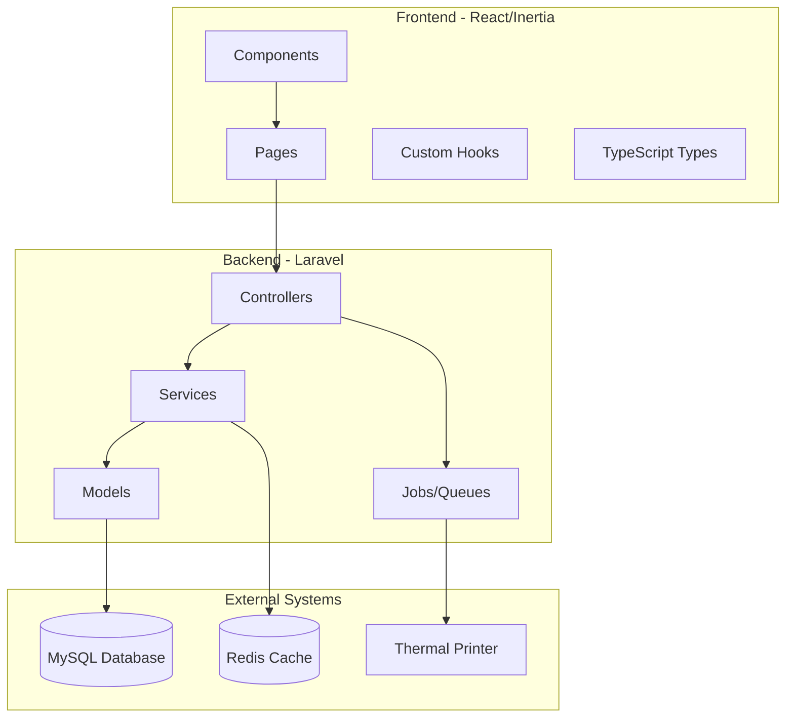
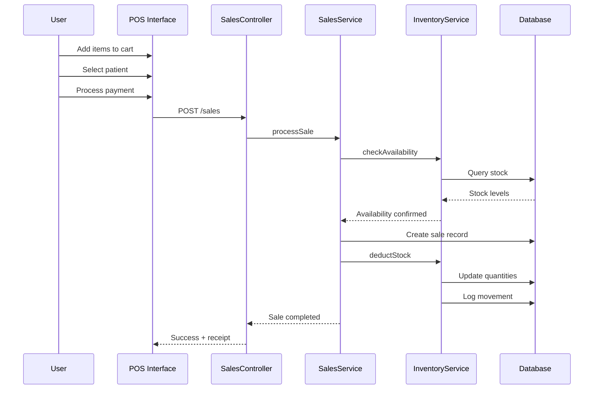
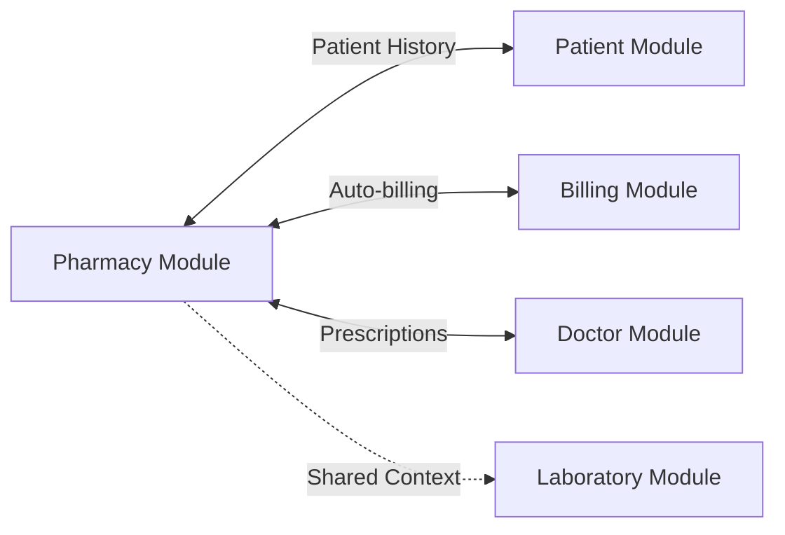

# Pharmacy Module Rebuild Plan

## Executive Summary

This document outlines a comprehensive plan for rebuilding the pharmacy module of the Hospital Management System (HMS). The rebuild aims to modernize the UI/UX, enhance functionality, improve performance, and ensure robust security while maintaining seamless integration with other hospital modules.

---

## 1. Current State Analysis

### 1.1 Existing Architecture

**Backend (Laravel)**
- **Controllers**: [`MedicineController`](app/Http/Controllers/Pharmacy/MedicineController.php:1), [`SalesController`](app/Http/Controllers/Pharmacy/SalesController.php:1), [`StockController`](app/Http/Controllers/Pharmacy/StockController.php:1), [`PurchaseOrderController`](app/Http/Controllers/Pharmacy/PurchaseOrderController.php:1), [`AlertController`](app/Http/Controllers/Pharmacy/AlertController.php:1)
- **Models**: [`Medicine`](app/Models/Medicine.php:1), [`Sale`](app/Models/Sale.php:1), [`SalesItem`](app/Models/SalesItem.php:1), [`PurchaseOrder`](app/Models/PurchaseOrder.php:1), [`PurchaseOrderItem`](app/Models/PurchaseOrderItem.php:1), [`Supplier`](app/Models/Supplier.php:1), [`MedicineCategory`](app/Models/MedicineCategory.php:1), [`MedicineAlert`](app/Models/MedicineAlert.php:1)
- **Database Tables**: medicines, sales, sales_items, purchase_orders, purchase_order_items, suppliers, medicine_categories, medicine_alerts

**Frontend (React + TypeScript + Inertia.js)**
- **Pages**: Limited existing pages - [`Medicines/Index`](resources/js/Pages/Pharmacy/Medicines/Index.tsx:1), [`Medicines/Create`](resources/js/Pages/Pharmacy/Medicines/Create.tsx:1), [`Sales/Index`](resources/js/Pages/Pharmacy/Sales/Index.tsx:1), [`PurchaseOrders/Index`](resources/js/Pages/Pharmacy/PurchaseOrders/Index.tsx:1)
- **Components**: No dedicated pharmacy components exist
- **Layout**: Uses [`HospitalLayout`](resources/js/layouts/HospitalLayout.tsx:1)

### 1.2 Identified Gaps

1. **Missing Frontend Pages**: No dedicated dashboard, stock management UI, alerts management, or reporting interface
2. **Limited Component Library**: No reusable pharmacy-specific components
3. **Incomplete CRUD**: Missing Edit/Show pages for most entities
4. **No Dashboard**: Lack of overview and analytics
5. **Basic Reporting**: Limited reporting capabilities
6. **No Barcode Integration**: Missing barcode/QR code support
7. **Limited Search**: Basic search without advanced filtering
8. **No Real-time Updates**: No WebSocket integration for stock updates

---

## 2. Target Architecture

### 2.1 Module Structure

```
pharmacy/
├── Dashboard/              # Pharmacy dashboard with analytics
├── Medicines/              # Medicine management
│   ├── Index.tsx
│   ├── Create.tsx
│   ├── Edit.tsx
│   ├── Show.tsx
│   └── Components/
├── Sales/                  # Sales/POS operations
│   ├── Index.tsx
│   ├── Create.tsx          # POS Interface
│   ├── Show.tsx
│   ├── Receipt.tsx
│   └── Components/
├── PurchaseOrders/         # Procurement management
│   ├── Index.tsx
│   ├── Create.tsx
│   ├── Edit.tsx
│   ├── Show.tsx
│   └── Components/
├── Stock/                  # Inventory management
│   ├── Index.tsx
│   ├── Adjustments.tsx
│   ├── Movements.tsx
│   └── Components/
├── Suppliers/              # Supplier management
│   ├── Index.tsx
│   ├── Create.tsx
│   ├── Edit.tsx
│   └── Show.tsx
├── Alerts/                 # Alert management
│   ├── Index.tsx
│   ├── Settings.tsx
│   └── Components/
├── Reports/                # Analytics and reporting
│   ├── Index.tsx
│   ├── SalesReport.tsx
│   ├── StockReport.tsx
│   └── ExpiryReport.tsx
└── Components/             # Shared pharmacy components
    ├── MedicineCard.tsx
    ├── MedicineSearch.tsx
    ├── StockBadge.tsx
    ├── ExpiryBadge.tsx
    ├── PriceDisplay.tsx
    ├── BarcodeScanner.tsx
    ├── Cart.tsx
    └── index.ts
```

### 2.2 Component Architecture

Following the Laboratory module pattern:

```typescript
// Shared pharmacy components
export { MedicineCard } from './MedicineCard';
export { StockBadge } from './StockBadge';
export { ExpiryBadge } from './ExpiryBadge';
export { PriceDisplay } from './PriceDisplay';
export { MedicineSearch } from './MedicineSearch';
export { Cart } from './Cart';
export { FilterBar } from './FilterBar';
```

---

## 3. Frontend Design

### 3.1 UI/UX Principles

Based on the Laboratory module's successful patterns:

1. **Card-Based Layout**: Use [`LabTestCard`](resources/js/components/laboratory/LabTestCard.tsx:1) pattern for medicine displays
2. **Filter Bar**: Implement [`FilterBar`](resources/js/components/laboratory/FilterBar.tsx:1) for advanced search
3. **Status Badges**: Color-coded badges for stock status, expiry, and order status
4. **Quick Actions**: Dashboard quick action cards like Laboratory module
5. **Responsive Design**: Mobile-friendly POS interface
6. **Real-time Updates**: Stock level indicators

### 3.2 Dashboard Design

Following [`Laboratory/Index.tsx`](resources/js/Pages/Laboratory/Index.tsx:1) pattern:

```typescript
interface PharmacyDashboardProps {
  stats: {
    totalMedicines: number;
    lowStockCount: number;
    expiringSoon: number;
    expiredCount: number;
    todaySales: number;
    pendingOrders: number;
    monthlyRevenue: number;
  };
  recentSales: Sale[];
  lowStockAlerts: Medicine[];
  expiringAlerts: Medicine[];
  activities: PharmacyActivity[];
}
```

### 3.3 Key Components

#### MedicineCard Component
```typescript
interface MedicineCardProps {
  medicine: Medicine;
  showStock?: boolean;
  showExpiry?: boolean;
  actions?: Action[];
  compact?: boolean;
}
```

#### StockBadge Component
```typescript
interface StockBadgeProps {
  quantity: number;
  minLevel: number;
  maxLevel?: number;
  showIndicator?: boolean;
}
// Variants: 'in-stock' | 'low-stock' | 'out-of-stock' | 'critical'
```

#### ExpiryBadge Component
```typescript
interface ExpiryBadgeProps {
  expiryDate: Date;
  daysThreshold?: number;
}
// Variants: 'valid' | 'expiring-soon' | 'expired'
```

#### Cart Component (POS)
```typescript
interface CartProps {
  items: CartItem[];
  onUpdateQuantity: (id: string, quantity: number) => void;
  onRemoveItem: (id: string) => void;
  onCheckout: () => void;
  patient?: Patient;
}
```

---

## 4. Backend Architecture

### 4.1 Controller Structure

**Enhanced Controllers:**
- [`MedicineController`](app/Http/Controllers/Pharmacy/MedicineController.php:1) - Add search, filtering, barcode endpoints
- [`SalesController`](app/Http/Controllers/Pharmacy/SalesController.php:1) - Add POS operations, receipt generation
- [`StockController`](app/Http/Controllers/Pharmacy/StockController.php:1) - Add adjustments, movements tracking
- [`PurchaseOrderController`](app/Http/Controllers/Pharmacy/PurchaseOrderController.php:1) - Add receiving, partial orders
- [`AlertController`](app/Http/Controllers/Pharmacy/AlertController.php:1) - Add configurable thresholds
- **New**: `DashboardController` - Analytics and statistics
- **New**: `ReportController` - Exportable reports
- **New**: `SupplierController` - Full CRUD for suppliers

### 4.2 API Endpoints

```php
// Dashboard
Route::get('/pharmacy/dashboard', [DashboardController::class, 'index']);

// Medicines
Route::get('/pharmacy/medicines/search', [MedicineController::class, 'search']);
Route::get('/pharmacy/medicines/barcode/{barcode}', [MedicineController::class, 'findByBarcode']);
Route::get('/pharmacy/medicines/low-stock', [MedicineController::class, 'lowStock']);
Route::get('/pharmacy/medicines/expiring', [MedicineController::class, 'expiringSoon']);
Route::get('/pharmacy/medicines/expired', [MedicineController::class, 'expired']);

// Sales
Route::post('/pharmacy/sales/quick', [SalesController::class, 'quickSale']);
Route::get('/pharmacy/sales/{sale}/receipt', [SalesController::class, 'receipt']);
Route::post('/pharmacy/sales/{sale}/void', [SalesController::class, 'void']);

// Stock
Route::post('/pharmacy/stock/adjust', [StockController::class, 'adjust']);
Route::get('/pharmacy/stock/movements', [StockController::class, 'movements']);
Route::get('/pharmacy/stock/valuation', [StockController::class, 'valuation']);

// Reports
Route::get('/pharmacy/reports/sales', [ReportController::class, 'salesReport']);
Route::get('/pharmacy/reports/stock', [ReportController::class, 'stockReport']);
Route::get('/pharmacy/reports/expiry', [ReportController::class, 'expiryReport']);
```

### 4.3 Services Layer

**New Services:**
```php
// Inventory Management
class InventoryService {
    public function adjustStock($medicineId, $quantity, $reason);
    public function getStockValuation();
    public function getMovementHistory($medicineId);
    public function checkAvailability($medicineId, $quantity);
}

// Alert Management
class AlertService {
    public function checkLowStock();
    public function checkExpiring();
    public function createAlert($type, $medicineId, $message);
    public function resolveAlert($alertId);
}

// Sales Processing
class SalesService {
    public function processSale($items, $patientId, $paymentDetails);
    public function calculateTotal($items);
    public function applyDiscount($saleId, $discount);
    public function generateReceipt($saleId);
}

// Barcode Generation
class BarcodeService {
    public function generateForMedicine($medicine);
    public function scan($barcode);
}
```

---

## 5. Database Schema Enhancements

### 5.1 New Tables

```sql
-- Stock movements tracking
CREATE TABLE stock_movements (
    id BIGINT PRIMARY KEY AUTO_INCREMENT,
    medicine_id BIGINT NOT NULL,
    type ENUM('in', 'out', 'adjustment', 'return') NOT NULL,
    quantity INT NOT NULL,
    previous_quantity INT NOT NULL,
    new_quantity INT NOT NULL,
    reason VARCHAR(255),
    reference_type VARCHAR(50), -- 'sale', 'purchase', 'adjustment'
    reference_id BIGINT,
    performed_by BIGINT NOT NULL,
    created_at TIMESTAMP DEFAULT CURRENT_TIMESTAMP,
    FOREIGN KEY (medicine_id) REFERENCES medicines(id),
    FOREIGN KEY (performed_by) REFERENCES users(id)
);

-- Medicine batches (for better expiry tracking)
CREATE TABLE medicine_batches (
    id BIGINT PRIMARY KEY AUTO_INCREMENT,
    medicine_id BIGINT NOT NULL,
    batch_number VARCHAR(100) NOT NULL,
    quantity INT NOT NULL,
    cost_price DECIMAL(10,2),
    expiry_date DATE NOT NULL,
    received_date DATE NOT NULL,
    supplier_id BIGINT,
    purchase_order_id BIGINT,
    status ENUM('active', 'expired', 'depleted') DEFAULT 'active',
    created_at TIMESTAMP DEFAULT CURRENT_TIMESTAMP,
    FOREIGN KEY (medicine_id) REFERENCES medicines(id),
    FOREIGN KEY (supplier_id) REFERENCES suppliers(id),
    FOREIGN KEY (purchase_order_id) REFERENCES purchase_orders(id)
);

-- Prescription integration
CREATE TABLE prescriptions (
    id BIGINT PRIMARY KEY AUTO_INCREMENT,
    prescription_code VARCHAR(50) UNIQUE NOT NULL,
    patient_id BIGINT NOT NULL,
    doctor_id BIGINT NOT NULL,
    diagnosis TEXT,
    notes TEXT,
    status ENUM('pending', 'dispensed', 'partial', 'cancelled') DEFAULT 'pending',
    created_at TIMESTAMP DEFAULT CURRENT_TIMESTAMP,
    FOREIGN KEY (patient_id) REFERENCES patients(id),
    FOREIGN KEY (doctor_id) REFERENCES doctors(id)
);

CREATE TABLE prescription_items (
    id BIGINT PRIMARY KEY AUTO_INCREMENT,
    prescription_id BIGINT NOT NULL,
    medicine_id BIGINT NOT NULL,
    dosage VARCHAR(100),
    frequency VARCHAR(100),
    duration VARCHAR(100),
    quantity INT NOT NULL,
    instructions TEXT,
    dispensed_quantity INT DEFAULT 0,
    FOREIGN KEY (prescription_id) REFERENCES prescriptions(id),
    FOREIGN KEY (medicine_id) REFERENCES medicines(id)
);
```

### 5.2 Table Modifications

```sql
-- Add barcode support to medicines
ALTER TABLE medicines ADD COLUMN barcode VARCHAR(100) UNIQUE AFTER medicine_code;
ALTER TABLE medicines ADD COLUMN qr_code VARCHAR(255) AFTER barcode;
ALTER TABLE medicines ADD COLUMN min_stock_level INT DEFAULT 10 AFTER quantity;
ALTER TABLE medicines ADD COLUMN max_stock_level INT AFTER min_stock_level;
ALTER TABLE medicines ADD COLUMN reorder_point INT DEFAULT 20 AFTER min_stock_level;
ALTER TABLE medicines ADD COLUMN location VARCHAR(100) AFTER instructions;
ALTER TABLE medicines ADD COLUMN is_prescription_required BOOLEAN DEFAULT FALSE;

-- Enhance sales table
ALTER TABLE sales ADD COLUMN prescription_id BIGINT AFTER patient_id;
ALTER TABLE sales ADD COLUMN payment_method ENUM('cash', 'card', 'insurance', 'credit') DEFAULT 'cash';
ALTER TABLE sales ADD COLUMN transaction_id VARCHAR(100);
ALTER TABLE sales ADD COLUMN is_voided BOOLEAN DEFAULT FALSE;
ALTER TABLE sales ADD COLUMN voided_at TIMESTAMP NULL;
ALTER TABLE sales ADD COLUMN voided_by BIGINT;
ALTER TABLE sales ADD COLUMN void_reason TEXT;
```

---

## 6. Integration Points

### 6.1 Patient Module Integration
```php
// Link sales to patients
$sale->patient_id = $patientId;

// View patient medication history
Route::get('/patients/{patient}/medications', [PatientController::class, 'medicationHistory']);
```

### 6.2 Billing Module Integration
```php
// Auto-create bill from pharmacy sale
class BillingIntegrationService {
    public function createBillFromSale($sale) {
        // Create bill items from sale items
        // Link bill to sale
    }
}
```

### 6.3 Doctor/Prescription Integration
```php
// Doctors can create prescriptions
Route::post('/doctors/prescriptions', [DoctorController::class, 'createPrescription']);

// Pharmacy can view pending prescriptions
Route::get('/pharmacy/prescriptions/pending', [PharmacyController::class, 'pendingPrescriptions']);
```

### 6.4 Laboratory Integration
- Share patient context
- Unified patient search
- Combined billing for lab + pharmacy

---

## 7. Security & Permissions

### 7.1 Role-Based Access Control

```php
// Permission definitions
'view-pharmacy'           // View pharmacy section
'view-medicines'          // View medicine catalog
'create-medicines'        // Add new medicines
'edit-medicines'          // Edit medicine details
'delete-medicines'        // Remove medicines
'view-sales'              // View sales history
'create-sales'            // Process sales (POS)
'void-sales'              // Cancel/void sales
'view-purchase-orders'    // View procurement
'create-purchase-orders'  // Create orders
'approve-purchase-orders' // Approve orders
'view-stock'              // View inventory
'adjust-stock'            // Manual stock adjustments
'view-alerts'             // View system alerts
'manage-alerts'           // Configure alert thresholds
'view-pharmacy-reports'   // Access reports
'export-pharmacy-data'    // Export functionality
```

### 7.2 Audit Trail

All critical operations logged:
- Stock adjustments
- Sale voids
- Price changes
- Purchase order approvals
- Alert resolutions

---

## 8. Features & Functionality

### 8.1 Core Features

| Feature | Priority | Description |
|---------|----------|-------------|
| Medicine Catalog | P0 | Full CRUD with search, filters, barcode |
| POS System | P0 | Point of sale with cart, receipt printing |
| Inventory Management | P0 | Stock tracking, adjustments, movements |
| Purchase Orders | P0 | Procurement workflow with approvals |
| Alerts & Notifications | P0 | Low stock, expiry warnings |
| Dashboard | P1 | Analytics overview with charts |
| Reporting | P1 | Sales, stock, expiry reports |
| Supplier Management | P1 | Full supplier CRUD |
| Prescription Integration | P1 | Doctor prescription workflow |
| Barcode/QR Support | P2 | Scanning and generation |
| Multi-location | P2 | Support multiple pharmacy locations |
| Insurance Integration | P2 | Insurance claim processing |

### 8.2 POS Features

- Quick medicine search (name, barcode)
- Cart management with quantity updates
- Patient selection/creation
- Multiple payment methods
- Discount application
- Receipt printing (thermal printer support)
- Return/refund processing

### 8.3 Inventory Features

- Real-time stock levels
- Batch tracking with expiry
- Automatic reorder suggestions
- Stock adjustment with reason
- Physical count reconciliation
- ABC analysis
- Stock valuation reports

---

## 9. Implementation Roadmap

### Phase 1: Foundation (Weeks 1-2)
- [ ] Set up component library structure
- [ ] Create shared pharmacy components
- [ ] Build dashboard layout and stats cards
- [ ] Implement basic navigation

### Phase 2: Medicine Management (Weeks 3-4)
- [ ] Medicine CRUD pages
- [ ] Medicine search and filtering
- [ ] Category management
- [ ] Barcode integration

### Phase 3: Sales & POS (Weeks 5-6)
- [ ] POS interface
- [ ] Cart functionality
- [ ] Receipt generation
- [ ] Sales history

### Phase 4: Inventory (Weeks 7-8)
- [ ] Stock management
- [ ] Stock adjustments
- [ ] Movement tracking
- [ ] Batch management

### Phase 5: Procurement (Weeks 9-10)
- [ ] Purchase order workflow
- [ ] Supplier management
- [ ] Receiving process
- [ ] Order tracking

### Phase 6: Alerts & Reporting (Weeks 11-12)
- [ ] Alert system
- [ ] Dashboard analytics
- [ ] Report generation
- [ ] Export functionality

### Phase 7: Integration (Weeks 13-14)
- [ ] Patient module integration
- [ ] Billing integration
- [ ] Prescription workflow
- [ ] Testing & QA

---

## 10. Technical Specifications

### 10.1 Frontend Stack

- **Framework**: React 18+ with TypeScript
- **UI Library**: shadcn/ui components
- **State Management**: React Query for server state
- **Forms**: React Hook Form with Zod validation
- **Charts**: Recharts for analytics
- **Icons**: Lucide React
- **Styling**: Tailwind CSS

### 10.2 Backend Stack

- **Framework**: Laravel 11+
- **ORM**: Eloquent with eager loading
- **Validation**: Form Request classes
- **Queue**: Redis for background jobs
- **Cache**: Redis for stock levels
- **Search**: Scout with database driver

### 10.3 Performance Optimizations

- Database indexing (already partially implemented)
- Eager loading for relationships
- Pagination for large datasets
- Debounced search inputs
- Optimistic UI updates
- Background job processing for reports

---

## 11. Mermaid Diagrams

### System Architecture


### Data Flow - Sales Process


### Module Integration


---

## 12. Success Metrics

- **Performance**: Page load < 2s, search results < 500ms
- **Usability**: Complete sale in < 30 seconds
- **Accuracy**: 99.9% stock accuracy
- **Availability**: 99.9% uptime
- **Adoption**: 100% staff training completion

---

## 13. Risk Mitigation

| Risk | Mitigation |
|------|------------|
| Data migration issues | Comprehensive backup strategy, phased rollout |
| Staff resistance | Training sessions, gradual transition |
| Performance bottlenecks | Load testing, caching strategy |
| Integration failures | API versioning, fallback mechanisms |
| Security vulnerabilities | Regular audits, input validation |

---

## 14. Conclusion

This rebuild plan provides a comprehensive roadmap for modernizing the pharmacy module. By following the Laboratory module's successful patterns and incorporating modern UI/UX principles, the new pharmacy module will enhance operational efficiency, improve user experience, and provide robust inventory management capabilities.

The phased approach ensures incremental delivery of value while minimizing risk. Each phase builds upon the previous, allowing for feedback and adjustments throughout the implementation process.
