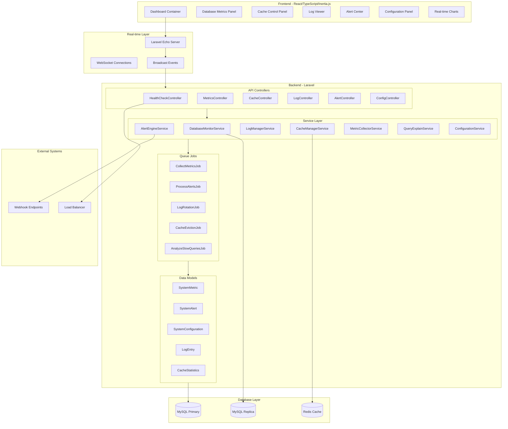

# System Health Monitoring Dashboard - Technical Architecture

## Overview
A comprehensive real-time monitoring dashboard for tracking database performance, cache management, log pipeline, and infrastructure health for the Hospital Management System.

---

## 1. System Architecture Diagram



---

## 2. Database Schema

### 2.1 Core Tables

```sql
-- System Metrics Storage
CREATE TABLE system_metrics (
    id BIGINT UNSIGNED AUTO_INCREMENT PRIMARY KEY,
    metric_type ENUM('database', 'cache', 'cpu', 'memory', 'disk_io', 'replication_lag', 'connection_pool'),
    metric_name VARCHAR(100) NOT NULL,
    metric_value DECIMAL(15, 4) NOT NULL,
    unit VARCHAR(20),
    host VARCHAR(255),
    metadata JSON,
    recorded_at TIMESTAMP DEFAULT CURRENT_TIMESTAMP,
    INDEX idx_metric_type_time (metric_type, recorded_at),
    INDEX idx_recorded_at (recorded_at),
    INDEX idx_host_metric (host, metric_name)
) ENGINE=InnoDB ROW_FORMAT=COMPRESSED;

-- Database Query Performance
CREATE TABLE query_performance_logs (
    id BIGINT UNSIGNED AUTO_INCREMENT PRIMARY KEY,
    query_hash VARCHAR(64) NOT NULL,
    query_pattern TEXT,
    execution_time_ms DECIMAL(10, 2),
    rows_examined BIGINT UNSIGNED,
    rows_sent BIGINT UNSIGNED,
    database_name VARCHAR(100),
    connection_id INT UNSIGNED,
    explain_plan JSON,
    is_slow_query BOOLEAN DEFAULT FALSE,
    created_at TIMESTAMP DEFAULT CURRENT_TIMESTAMP,
    INDEX idx_query_hash (query_hash),
    INDEX idx_slow_queries (is_slow_query, created_at),
    INDEX idx_execution_time (execution_time_ms),
    INDEX idx_created_at (created_at)
) ENGINE=InnoDB ROW_FORMAT=COMPRESSED;

-- Connection Pool Status
CREATE TABLE connection_pool_stats (
    id BIGINT UNSIGNED AUTO_INCREMENT PRIMARY KEY,
    pool_name VARCHAR(50) NOT NULL,
    total_connections INT UNSIGNED,
    active_connections INT UNSIGNED,
    idle_connections INT UNSIGNED,
    waiting_threads INT UNSIGNED,
    max_connections INT UNSIGNED,
    connection_wait_time_ms DECIMAL(10, 2),
    recorded_at TIMESTAMP DEFAULT CURRENT_TIMESTAMP,
    INDEX idx_pool_time (pool_name, recorded_at)
) ENGINE=InnoDB;

-- Deadlock Events
CREATE TABLE deadlock_events (
    id BIGINT UNSIGNED AUTO_INCREMENT PRIMARY KEY,
    deadlock_id VARCHAR(64) UNIQUE,
    victim_thread_id BIGINT UNSIGNED,
    involved_threads JSON,
    lock_resource JSON,
    transaction_info JSON,
    detected_at TIMESTAMP DEFAULT CURRENT_TIMESTAMP,
    resolved_at TIMESTAMP NULL,
    INDEX idx_detected_at (detected_at)
) ENGINE=InnoDB;

-- Cache Statistics
CREATE TABLE cache_statistics (
    id BIGINT UNSIGNED AUTO_INCREMENT PRIMARY KEY,
    cache_store VARCHAR(50) NOT NULL,
    operation_type ENUM('hit', 'miss', 'write', 'delete', 'evict'),
    key_pattern VARCHAR(255),
    key_size_bytes INT UNSIGNED,
    value_size_bytes INT UNSIGNED,
    ttl_seconds INT UNSIGNED,
    memory_usage_bytes BIGINT UNSIGNED,
    hit_rate DECIMAL(5, 2),
    recorded_at TIMESTAMP DEFAULT CURRENT_TIMESTAMP,
    INDEX idx_cache_store_time (cache_store, recorded_at),
    INDEX idx_operation_type (operation_type)
) ENGINE=InnoDB;

-- Cache Eviction Log
CREATE TABLE cache_eviction_log (
    id BIGINT UNSIGNED AUTO_INCREMENT PRIMARY KEY,
    eviction_type ENUM('ttl_expired', 'memory_pressure', 'lru_eviction', 'manual_clear'),
    keys_affected INT UNSIGNED,
    memory_freed_bytes BIGINT UNSIGNED,
    trigger_threshold DECIMAL(5, 2),
    current_memory_usage DECIMAL(5, 2),
    triggered_by VARCHAR(100),
    executed_at TIMESTAMP DEFAULT CURRENT_TIMESTAMP,
    INDEX idx_eviction_type (eviction_type),
    INDEX idx_executed_at (executed_at)
) ENGINE=InnoDB;

-- System Alerts
CREATE TABLE system_alerts (
    id BIGINT UNSIGNED AUTO_INCREMENT PRIMARY KEY,
    alert_code VARCHAR(50) NOT NULL,
    severity ENUM('info', 'warning', 'critical', 'emergency'),
    category ENUM('database', 'cache', 'performance', 'security', 'infrastructure'),
    title VARCHAR(255),
    message TEXT,
    metric_type VARCHAR(50),
    threshold_value DECIMAL(15, 4),
    actual_value DECIMAL(15, 4),
    is_acknowledged BOOLEAN DEFAULT FALSE,
    acknowledged_by BIGINT UNSIGNED,
    acknowledged_at TIMESTAMP NULL,
    resolved_at TIMESTAMP NULL,
    metadata JSON,
    created_at TIMESTAMP DEFAULT CURRENT_TIMESTAMP,
    INDEX idx_severity_created (severity, created_at),
    INDEX idx_acknowledged (is_acknowledged),
    INDEX idx_category_time (category, created_at),
    INDEX idx_alert_code (alert_code)
) ENGINE=InnoDB;

-- Alert Rules/Configuration
CREATE TABLE alert_rules (
    id BIGINT UNSIGNED AUTO_INCREMENT PRIMARY KEY,
    rule_name VARCHAR(100) NOT NULL,
    metric_type VARCHAR(50) NOT NULL,
    operator ENUM('gt', 'lt', 'eq', 'gte', 'lte', 'between'),
    threshold_value DECIMAL(15, 4),
    threshold_max DECIMAL(15, 4),
    severity ENUM('info', 'warning', 'critical', 'emergency'),
    cooldown_minutes INT UNSIGNED DEFAULT 15,
    is_active BOOLEAN DEFAULT TRUE,
    notification_channels JSON,
    webhook_urls JSON,
    metadata JSON,
    created_at TIMESTAMP DEFAULT CURRENT_TIMESTAMP,
    updated_at TIMESTAMP DEFAULT CURRENT_TIMESTAMP ON UPDATE CURRENT_TIMESTAMP,
    INDEX idx_metric_active (metric_type, is_active),
    INDEX idx_severity (severity)
) ENGINE=InnoDB;

-- Log Entries (Structured)
CREATE TABLE log_entries (
    id BIGINT UNSIGNED AUTO_INCREMENT PRIMARY KEY,
    log_level ENUM('debug', 'info', 'warning', 'error', 'critical'),
    channel VARCHAR(50),
    message TEXT,
    context JSON,
    exception_class VARCHAR(255),
    exception_trace TEXT,
    user_id BIGINT UNSIGNED,
    request_id VARCHAR(64),
    ip_address VARCHAR(45),
    user_agent TEXT,
    url VARCHAR(500),
    method VARCHAR(10),
    execution_time_ms DECIMAL(10, 2),
    memory_usage_mb DECIMAL(10, 2),
    log_file VARCHAR(255),
    log_file_line INT UNSIGNED,
    archived BOOLEAN DEFAULT FALSE,
    archived_at TIMESTAMP NULL,
    created_at TIMESTAMP DEFAULT CURRENT_TIMESTAMP,
    INDEX idx_level_channel_time (log_level, channel, created_at),
    INDEX idx_request_id (request_id),
    INDEX idx_exception_class (exception_class),
    INDEX idx_user_id (user_id),
    INDEX idx_created_at (created_at),
    INDEX idx_archived (archived)
) ENGINE=InnoDB ROW_FORMAT=COMPRESSED PARTITION BY RANGE (YEAR(created_at)) (
    PARTITION p2024 VALUES LESS THAN (2025),
    PARTITION p2025 VALUES LESS THAN (2026),
    PARTITION p2026 VALUES LESS THAN (2027),
    PARTITION p_future VALUES LESS THAN MAXVALUE
);

-- Log Archive Tracking
CREATE TABLE log_archives (
    id BIGINT UNSIGNED AUTO_INCREMENT PRIMARY KEY,
    archive_name VARCHAR(255) NOT NULL,
    date_from DATE NOT NULL,
    date_to DATE NOT NULL,
    log_level VARCHAR(20),
    channel VARCHAR(50),
    original_size_bytes BIGINT UNSIGNED,
    compressed_size_bytes BIGINT UNSIGNED,
    record_count INT UNSIGNED,
    storage_path VARCHAR(500),
    compression_format ENUM('gzip', 'zip', '7z'),
    checksum VARCHAR(64),
    restored_at TIMESTAMP NULL,
    created_at TIMESTAMP DEFAULT CURRENT_TIMESTAMP,
    INDEX idx_date_range (date_from, date_to),
    INDEX idx_created_at (created_at)
) ENGINE=InnoDB;

-- System Configuration
CREATE TABLE system_configurations (
    id BIGINT UNSIGNED AUTO_INCREMENT PRIMARY KEY,
    config_key VARCHAR(100) UNIQUE NOT NULL,
    config_value JSON,
    data_type ENUM('string', 'integer', 'float', 'boolean', 'json', 'array'),
    category ENUM('database', 'cache', 'logging', 'alerts', 'performance', 'security'),
    description TEXT,
    is_editable BOOLEAN DEFAULT TRUE,
    requires_restart BOOLEAN DEFAULT FALSE,
    last_modified_by BIGINT UNSIGNED,
    created_at TIMESTAMP DEFAULT CURRENT_TIMESTAMP,
    updated_at TIMESTAMP DEFAULT CURRENT_TIMESTAMP ON UPDATE CURRENT_TIMESTAMP,
    INDEX idx_category (category),
    INDEX idx_editable (is_editable)
) ENGINE=InnoDB;

-- Replication Status
CREATE TABLE replication_status (
    id BIGINT UNSIGNED AUTO_INCREMENT PRIMARY KEY,
    master_host VARCHAR(255),
    slave_host VARCHAR(255),
    slave_io_running BOOLEAN,
    slave_sql_running BOOLEAN,
    seconds_behind_master INT UNSIGNED,
    master_log_file VARCHAR(100),
    read_master_log_pos BIGINT UNSIGNED,
    relay_log_file VARCHAR(100),
    relay_log_pos BIGINT UNSIGNED,
    last_error TEXT,
    last_error_number INT,
    recorded_at TIMESTAMP DEFAULT CURRENT_TIMESTAMP,
    INDEX idx_slave_host_time (slave_host, recorded_at),
    INDEX idx_seconds_behind (seconds_behind_master)
) ENGINE=InnoDB;

-- Notification Webhooks
CREATE TABLE notification_webhooks (
    id BIGINT UNSIGNED AUTO_INCREMENT PRIMARY KEY,
    name VARCHAR(100) NOT NULL,
    webhook_url VARCHAR(500) NOT NULL,
    webhook_method ENUM('POST', 'PUT', 'PATCH') DEFAULT 'POST',
    headers JSON,
    payload_template TEXT,
    retry_attempts INT UNSIGNED DEFAULT 3,
    retry_delay_seconds INT UNSIGNED DEFAULT 60,
    timeout_seconds INT UNSIGNED DEFAULT 30,
    is_active BOOLEAN DEFAULT TRUE,
    last_triggered_at TIMESTAMP NULL,
    last_success_at TIMESTAMP NULL,
    failure_count INT UNSIGNED DEFAULT 0,
    created_at TIMESTAMP DEFAULT CURRENT_TIMESTAMP,
    updated_at TIMESTAMP DEFAULT CURRENT_TIMESTAMP ON UPDATE CURRENT_TIMESTAMP,
    INDEX idx_active (is_active)
) ENGINE=InnoDB;

-- Health Check History
CREATE TABLE health_check_history (
    id BIGINT UNSIGNED AUTO_INCREMENT PRIMARY KEY,
    check_type ENUM('database', 'cache', 'queue', 'storage', 'external_api'),
    check_name VARCHAR(100),
    status ENUM('passing', 'failing', 'degraded'),
    response_time_ms DECIMAL(10, 2),
    error_message TEXT,
    metadata JSON,
    checked_at TIMESTAMP DEFAULT CURRENT_TIMESTAMP,
    INDEX idx_check_type_time (check_type, checked_at),
    INDEX idx_status (status)
) ENGINE=InnoDB;
```

### 2.2 Migration Files Structure

```
database/migrations/
├── 2026_02_28_000001_create_system_metrics_table.php
├── 2026_02_28_000002_create_query_performance_logs_table.php
├── 2026_02_28_000003_create_connection_pool_stats_table.php
├── 2026_02_28_000004_create_deadlock_events_table.php
├── 2026_02_28_000005_create_cache_statistics_table.php
├── 2026_02_28_000006_create_cache_eviction_log_table.php
├── 2026_02_28_000007_create_system_alerts_table.php
├── 2026_02_28_000008_create_alert_rules_table.php
├── 2026_02_28_000009_create_log_entries_table.php
├── 2026_02_28_000010_create_log_archives_table.php
├── 2026_02_28_000011_create_system_configurations_table.php
├── 2026_02_28_000012_create_replication_status_table.php
├── 2026_02_28_000013_create_notification_webhooks_table.php
└── 2026_02_28_000014_create_health_check_history_table.php
```

---

## 3. API Endpoint Specifications

### 3.1 REST API Endpoints

#### Health Check Endpoints
```
GET  /api/health/status                    # Overall system health
GET  /api/health/checks                    # List all health checks
GET  /api/health/checks/{type}             # Specific health check type
POST /api/health/checks/{id}/trigger       # Manual health check trigger
```

#### Database Monitoring Endpoints
```
GET  /api/monitoring/database/connections   # Connection pool status
GET  /api/monitoring/database/queries       # Query performance metrics
GET  /api/monitoring/database/queries/slow  # Slow query list
GET  /api/monitoring/database/queries/{hash}/explain  # EXPLAIN plan
GET  /api/monitoring/database/deadlocks     # Deadlock events
GET  /api/monitoring/database/replication   # Replication lag status
GET  /api/monitoring/database/resources     # CPU/Memory/Disk I/O
```

#### Cache Management Endpoints
```
GET  /api/cache/statistics                 # Cache hit/miss stats
GET  /api/cache/keys                       # List cache keys (paginated)
POST /api/cache/clear                      # Clear cache (manual)
POST /api/cache/clear/{tag}                # Clear cache by tag
GET  /api/cache/policies                   # Get eviction policies
PUT  /api/cache/policies                   # Update eviction policies
GET  /api/cache/eviction-history           # Eviction log
```

#### Log Management Endpoints
```
GET  /api/logs                             # Search/filter logs
GET  /api/logs/{id}                        # Single log entry
GET  /api/logs/levels                      # Available log levels
GET  /api/logs/channels                    # Available channels
POST /api/logs/search                      # Advanced log search
GET  /api/logs/archives                    # List archives
POST /api/logs/archives/create             # Create new archive
POST /api/logs/archives/{id}/restore       # Restore from archive
GET  /api/logs/archives/{id}/download      # Download archive
```

#### Alert Management Endpoints
```
GET  /api/alerts                           # List alerts (paginated, filtered)
GET  /api/alerts/{id}                      # Single alert details
POST /api/alerts/{id}/acknowledge          # Acknowledge alert
POST /api/alerts/{id}/resolve              # Resolve alert
DELETE /api/alerts/{id}                    # Delete alert
GET  /api/alerts/rules                     # List alert rules
POST /api/alerts/rules                     # Create alert rule
PUT  /api/alerts/rules/{id}                # Update alert rule
DELETE /api/alerts/rules/{id}              # Delete alert rule
GET  /api/alerts/analytics                 # Alert analytics/trends
```

#### Configuration Endpoints
```
GET  /api/config                           # List all configurations
GET  /api/config/{key}                     # Get specific config
PUT  /api/config/{key}                     # Update config value
POST /api/config/bulk-update               # Bulk update configs
GET  /api/config/categories                # Config categories
POST /api/config/reset/{key}               # Reset to default
```

#### Metrics Endpoints
```
GET  /api/metrics                          # All metrics summary
GET  /api/metrics/{type}                   # Metrics by type
GET  /api/metrics/{type}/history           # Historical metrics
GET  /api/metrics/dashboard                # Dashboard metrics bundle
GET  /api/metrics/export                   # Export metrics data
```

#### Webhook Management Endpoints
```
GET  /api/webhooks                         # List webhooks
POST /api/webhooks                         # Create webhook
PUT  /api/webhooks/{id}                    # Update webhook
DELETE /api/webhooks/{id}                  # Delete webhook
POST /api/webhooks/{id}/test               # Test webhook
POST /api/webhooks/{id}/toggle             # Enable/disable
```

### 3.2 WebSocket Events

#### Channels
```javascript
// Private channels for authenticated users
private-system-health          // General health updates
private-metrics-{metric_type}  // Specific metric type updates
private-alerts                 // Real-time alerts
private-logs                   // Live log streaming

// Presence channels for admin monitoring
presence-system-monitor        // Admin presence tracking
```

#### Broadcasting Events
```php
// Server-side events broadcasted
DatabaseMetricsUpdated         // Real-time DB metrics
CacheStatisticsUpdated         // Cache stats update
NewAlertTriggered              // New alert notification
AlertAcknowledged              // Alert acknowledged
AlertResolved                  // Alert resolved
LogEntryCreated                // New log entry
HealthCheckCompleted           // Health check result
ReplicationLagChanged          // Replication status change
DeadlockDetected               // Deadlock event
SlowQueryDetected              // Slow query alert
ConfigurationChanged           // Config update notification
```

#### Client Events (Whisper)
```javascript
// Client-initiated events
client-subscribe-metric        // Subscribe to metric stream
client-unsubscribe-metric      // Unsubscribe from metric stream
client-acknowledge-alert       // Acknowledge from dashboard
```

---

## 4. Frontend Component Architecture

### 4.1 Component Hierarchy

```
resources/js/Pages/SystemHealth/
├── Dashboard.tsx                          # Main dashboard page
├── components/
│   ├── layout/
│   │   ├── DashboardLayout.tsx            # Dashboard shell
│   │   ├── Sidebar.tsx                    # Navigation sidebar
│   │   ├── Header.tsx                     # Top header bar
│   │   └── MetricCard.tsx                 # Reusable metric card
│   │
│   ├── database/
│   │   ├── DatabaseMetricsPanel.tsx       # DB metrics container
│   │   ├── ConnectionPoolChart.tsx        # Connection pool visualization
│   │   ├── QueryPerformanceTable.tsx      # Query performance list
│   │   ├── SlowQueryAlert.tsx             # Slow query notifications
│   │   ├── DeadlockMonitor.tsx            # Deadlock display
│   │   ├── ReplicationStatus.tsx          # Replication monitoring
│   │   ├── ResourceUtilization.tsx        # CPU/Memory/Disk charts
│   │   └── ExplainPlanViewer.tsx          # EXPLAIN plan display
│   │
│   ├── cache/
│   │   ├── CacheManagementPanel.tsx       # Cache control container
│   │   ├── CacheStatistics.tsx            # Hit/miss statistics
│   │   ├── CacheKeyBrowser.tsx            # Browse cache keys
│   │   ├── ManualCacheClear.tsx           # Manual clear interface
│   │   ├── EvictionPolicyConfig.tsx       # Policy configuration
│   │   └── CacheEvictionHistory.tsx       # Eviction log table
│   │
│   ├── logs/
│   │   ├── LogViewerPanel.tsx             # Log viewer container
│   │   ├── LogSearchBar.tsx               # Search/filter controls
│   │   ├── LogTable.tsx                   # Log entries table
│   │   ├── LogDetailModal.tsx             # Log entry detail
│   │   ├── LogLevelFilter.tsx             # Level filter chips
│   │   ├── DateRangePicker.tsx            # Date range selector
│   │   ├── ArchiveManager.tsx             # Archive management
│   │   └── LiveLogStream.tsx              # Real-time log tail
│   │
│   ├── alerts/
│   │   ├── AlertCenterPanel.tsx           # Alerts container
│   │   ├── AlertList.tsx                  # Alert list view
│   │   ├── AlertCard.tsx                  # Individual alert card
│   │   ├── AlertFilters.tsx               # Filter controls
│   │   ├── AlertAcknowledgeDialog.tsx     # Acknowledge modal
│   │   ├── AlertRuleEditor.tsx            # Rule creation/editing
│   │   ├── AlertAnalytics.tsx             # Trend charts
│   │   └── AlertNotificationSettings.tsx  # Notification config
│   │
│   ├── config/
│   │   ├── ConfigurationPanel.tsx         # Config container
│   │   ├── ConfigCategoryTabs.tsx         # Category navigation
│   │   ├── ConfigEditor.tsx               # Config value editor
│   │   ├── ConfigHistory.tsx              # Change history
│   │   └── BulkConfigUpdate.tsx           # Bulk update interface
│   │
│   └── shared/
│       ├── RealtimeChart.tsx              # Chart.js wrapper
│       ├── MetricSparkline.tsx            # Mini sparkline chart
│       ├── StatusIndicator.tsx            # Status badge
│       ├── ProgressBar.tsx                # Animated progress
│       ├── DataTable.tsx                  # Reusable data table
│       ├── SearchInput.tsx                # Debounced search
│       ├── TimeRangeSelector.tsx          // Time range picker
│       ├── NotificationToast.tsx          # Toast notifications
│       ├── WebSocketStatus.tsx            # Connection status
│       └── LoadingSkeleton.tsx            # Loading states
│
├── hooks/
│   ├── useWebSocket.ts                    # WebSocket connection hook
│   ├── useMetrics.ts                      # Metrics data hook
│   ├── useAlerts.ts                       # Alerts management hook
│   ├── useCache.ts                        // Cache operations hook
│   ├── useLogs.ts                         // Log search hook
│   ├── useConfiguration.ts                # Config management hook
│   ├── useHealthChecks.ts                 # Health check hook
│   └── useRealtime.ts                     # Real-time updates hook
│
├── types/
│   ├── metric.types.ts                    # Metric interfaces
│   ├── alert.types.ts                     # Alert interfaces
│   ├── cache.types.ts                     # Cache interfaces
│   ├── log.types.ts                       # Log interfaces
│   ├── config.types.ts                    # Config interfaces
│   └── health.types.ts                    # Health check interfaces
│
└── utils/
    ├── chartConfig.ts                     # Chart.js configurations
    ├── formatters.ts                      # Data formatters
    ├── colorScales.ts                     # Status color mappings
    ├── timeRanges.ts                      # Time range utilities
    └── validators.ts                      # Input validation
```

### 4.2 State Management Structure

```typescript
// Global state with Zustand or React Context
interface SystemHealthState {
    // Real-time data
    metrics: {
        database: DatabaseMetrics;
        cache: CacheMetrics;
        system: SystemMetrics;
        replication: ReplicationStatus;
    };
    
    // Alerts
    alerts: Alert[];
    unreadCount: number;
    alertRules: AlertRule[];
    
    // Logs
    logs: LogEntry[];
    logFilters: LogFilters;
    isStreaming: boolean;
    
    // Configuration
    configurations: SystemConfiguration[];
    pendingChanges: ConfigChange[];
    
    // UI State
    selectedTimeRange: TimeRange;
    activePanels: PanelId[];
    sidebarCollapsed: boolean;
    
    // WebSocket
    connectionStatus: 'connected' | 'disconnected' | 'reconnecting';
    subscribedChannels: string[];
}
```

---

## 5. Backend Service Class Structure

### 5.1 Service Layer

```php
// app/Services/Monitoring/
namespace App\Services\Monitoring;

abstract class BaseMonitoringService
{
    protected array $config;
    protected LoggerInterface $logger;
    
    abstract public function collect(): array;
    abstract public function healthCheck(): HealthStatus;
}

class DatabaseMonitorService extends BaseMonitoringService
{
    public function collect(): array;
    public function healthCheck(): HealthStatus;
    public function getConnectionPoolStats(): ConnectionPoolStats;
    public function getQueryPerformance(int $limit = 100): array;
    public function getSlowQueries(float $thresholdMs = 1000): array;
    public function getExplainPlan(string $queryHash): ExplainPlan;
    public function detectDeadlocks(): array;
    public function getReplicationLag(): ReplicationStatus;
    public function getResourceUtilization(): ResourceMetrics;
}

class CacheManagerService extends BaseMonitoringService
{
    public function collect(): array;
    public function healthCheck(): HealthStatus;
    public function getStatistics(string $store = 'redis'): CacheStatistics;
    public function getKeys(string $pattern = '*', int $page = 1): array;
    public function clear(string $tag = null): bool;
    public function clearByPattern(string $pattern): int;
    public function getEvictionPolicies(): array;
    public function setEvictionPolicy(string $policy, array $config): bool;
    public function getEvictionHistory(int $limit = 50): array;
    public function manualEvict(string $strategy, array $params): EvictionResult;
    public function scheduleEviction(array $config): void;
}

class LogManagerService extends BaseMonitoringService
{
    public function collect(): array;
    public function healthCheck(): HealthStatus;
    public function search(LogSearchCriteria $criteria): PaginatedResult;
    public function getById(int $id): LogEntry;
    public function stream(callable $callback): void;
    public function createArchive(DateRange $range, array $filters): Archive;
    public function restoreArchive(int $archiveId): bool;
    public function rotateLogs(): RotationResult;
    public function compressOldLogs(int $daysOld = 30): CompressionResult;
    public function getChannels(): array;
    public function getLevels(): array;
}

class AlertEngineService extends BaseMonitoringService
{
    public function collect(): array;
    public function healthCheck(): HealthStatus;
    public function evaluateRules(): array;
    public function createAlert(AlertData $data): Alert;
    public function acknowledge(int $alertId, int $userId): bool;
    public function resolve(int $alertId): bool;
    public function getRules(): array;
    public function createRule(AlertRule $rule): AlertRule;
    public function updateRule(int $id, AlertRule $rule): AlertRule;
    public function deleteRule(int $id): bool;
    public function getAnalytics(DateRange $range): AlertAnalytics;
    public function triggerTest(int $ruleId): bool;
}

class MetricCollectorService extends BaseMonitoringService
{
    public function collect(): array;
    public function collectAll(): array;
    public function collectByType(string $type): array;
    public function store(array $metrics): void;
    public function getHistory(string $type, DateRange $range): array;
    public function getAggregated(string $type, string $granularity): array;
    public function export(DateRange $range, string $format): string;
    public function getDashboardBundle(): DashboardMetrics;
}

class QueryExplainService
{
    public function generateExplainPlan(string $query): ExplainPlan;
    public function analyzePlan(ExplainPlan $plan): PlanAnalysis;
    public function suggestOptimizations(ExplainPlan $plan): array;
    public function formatForDisplay(ExplainPlan $plan): array;
    public function isSlowQuery(float $executionTimeMs): bool;
}

class ConfigurationService extends BaseMonitoringService
{
    public function collect(): array;
    public function healthCheck(): HealthStatus;
    public function get(string $key): mixed;
    public function getAll(string $category = null): array;
    public function set(string $key, mixed $value): bool;
    public function bulkUpdate(array $updates): array;
    public function reset(string $key): bool;
    public function getCategories(): array;
    public function getHistory(string $key): array;
    public function validate(string $key, mixed $value): ValidationResult;
}

class WebhookNotificationService
{
    public function send(Alert $alert, Webhook $webhook): WebhookResponse;
    public function sendBatch(array $alerts, array $webhooks): array;
    public function test(Webhook $webhook): WebhookResponse;
    public function retryFailed(int $webhookId): bool;
    public function getPending(): array;
}

class HealthCheckService extends BaseMonitoringService
{
    public function collect(): array;
    public function runAll(): array;
    public function run(string $type): HealthStatus;
    public function getHistory(string $type, int $limit = 100): array;
    public function registerCustomCheck(string $name, callable $check): void;
}

class ReplicationMonitorService
{
    public function getStatus(): ReplicationStatus;
    public function getLagHistory(DateRange $range): array;
    public function detectReplicationIssues(): array;
    public function getTopology(): ReplicationTopology;
}
```

### 5.2 Background Jobs

```php
// app/Jobs/Monitoring/
namespace App\Jobs\Monitoring;

class CollectMetricsJob implements ShouldQueue
{
    public function handle(
        DatabaseMonitorService $dbMonitor,
        CacheManagerService $cacheManager,
        MetricCollectorService $collector
    ): void;
}

class ProcessAlertsJob implements ShouldQueue
{
    public function handle(AlertEngineService $alertEngine): void;
}

class LogRotationJob implements ShouldQueue
{
    public function handle(LogManagerService $logManager): void;
}

class CacheEvictionJob implements ShouldQueue
{
    public function handle(CacheManagerService $cacheManager): void;
}

class AnalyzeSlowQueriesJob implements ShouldQueue
{
    public function handle(QueryExplainService $explainService): void;
}

class SendWebhookNotificationsJob implements ShouldQueue
{
    public function handle(WebhookNotificationService $webhookService): void;
    public $tries = 3;
    public $backoff = [60, 300, 900];
}

class ArchiveOldLogsJob implements ShouldQueue
{
    public function handle(LogManagerService $logManager): void;
}

class CheckReplicationLagJob implements ShouldQueue
{
    public function handle(ReplicationMonitorService $replicationService): void;
}
```

### 5.3 Event Classes

```php
// app/Events/Monitoring/
namespace App\Events\Monitoring;

class DatabaseMetricsUpdated implements ShouldBroadcast
{
    public function broadcastOn(): array;
    public function broadcastAs(): string;
}

class CacheStatisticsUpdated implements ShouldBroadcast
{
    public function broadcastOn(): array;
    public function broadcastAs(): string;
}

class NewAlertTriggered implements ShouldBroadcast
{
    public function broadcastOn(): array;
    public function broadcastAs(): string;
}

class LogEntryCreated implements ShouldBroadcast
{
    public function broadcastOn(): array;
    public function broadcastAs(): string;
}

class HealthCheckCompleted implements ShouldBroadcast
{
    public function broadcastOn(): array;
    public function broadcastAs(): string;
}

class DeadlockDetected implements ShouldBroadcast
{
    public function broadcastOn(): array;
    public function broadcastAs(): string;
}

class SlowQueryDetected implements ShouldBroadcast
{
    public function broadcastOn(): array;
    public function broadcastAs(): string;
}

class ConfigurationChanged implements ShouldBroadcast
{
    public function broadcastOn(): array;
    public function broadcastAs(): string;
}
```

### 5.4 Data Transfer Objects

```php
// app/DTOs/Monitoring/
namespace App\DTOs\Monitoring;

class DatabaseMetrics
{
    public function __construct(
        public readonly ConnectionPoolStats $connectionPool,
        public readonly array $queryPerformance,
        public readonly ResourceMetrics $resources,
        public readonly ?ReplicationStatus $replication,
        public readonly DateTime $timestamp
    );
}

class ConnectionPoolStats
{
    public function __construct(
        public readonly int $totalConnections,
        public readonly int $activeConnections,
        public readonly int $idleConnections,
        public readonly int $waitingThreads,
        public readonly int $maxConnections,
        public readonly float $utilizationPercentage,
        public readonly float $averageWaitTimeMs
    );
}

class CacheMetrics
{
    public function __construct(
        public readonly string $store,
        public readonly int $totalKeys,
        public readonly float $hitRate,
        public readonly int $hits,
        public readonly int $misses,
        public readonly int $memoryUsedBytes,
        public readonly int $memoryLimitBytes,
        public readonly float $memoryUsagePercentage
    );
}

class AlertData
{
    public function __construct(
        public readonly string $alertCode,
        public readonly string $severity,
        public readonly string $category,
        public readonly string $title,
        public readonly string $message,
        public readonly ?float $thresholdValue = null,
        public readonly ?float $actualValue = null,
        public readonly ?array $metadata = null
    );
}

class HealthStatus
{
    public function __construct(
        public readonly string $checkType,
        public readonly string $status, // passing, failing, degraded
        public readonly ?string $message = null,
        public readonly ?float $responseTimeMs = null,
        public readonly ?array $metadata = null
    );
}

class LogSearchCriteria
{
    public function __construct(
        public readonly ?array $levels = null,
        public readonly ?array $channels = null,
        public readonly ?DateTime $from = null,
        public readonly ?DateTime $to = null,
        public readonly ?string $searchTerm = null,
        public readonly ?int $userId = null,
        public readonly ?string $requestId = null,
        public readonly int $page = 1,
        public readonly int $perPage = 50
    );
}
```

---

## 6. Configuration File Structure

### 6.1 Main Configuration

```php
// config/system-health.php
<?php

return [
    /*
    |--------------------------------------------------------------------------
    | General Settings
    |--------------------------------------------------------------------------
    */
    'enabled' => env('SYSTEM_HEALTH_ENABLED', true),
    'environment' => env('APP_ENV', 'production'),
    
    /*
    |--------------------------------------------------------------------------
    | Database Monitoring Configuration
    |--------------------------------------------------------------------------
    */
    'database' => [
        'monitoring_enabled' => true,
        'metrics_collection_interval' => 60, // seconds
        
        'connection_pool' => [
            'warning_threshold' => 70,  // percentage
            'critical_threshold' => 90, // percentage
            'max_wait_time_ms' => 5000,
        ],
        
        'query_performance' => [
            'slow_query_threshold_ms' => 1000,
            'log_slow_queries' => true,
            'auto_explain' => true,
            'top_queries_limit' => 50,
            'retention_days' => 30,
        ],
        
        'deadlock_detection' => [
            'enabled' => true,
            'check_interval' => 30, // seconds
            'alert_on_detection' => true,
        ],
        
        'replication' => [
            'monitor_lag' => true,
            'warning_threshold_seconds' => 5,
            'critical_threshold_seconds' => 30,
            'check_interval' => 10,
        ],
        
        'resources' => [
            'monitor_cpu' => true,
            'monitor_memory' => true,
            'monitor_disk_io' => true,
            'cpu_warning' => 70,
            'cpu_critical' => 90,
            'memory_warning' => 80,
            'memory_critical' => 95,
        ],
    ],
    
    /*
    |--------------------------------------------------------------------------
    | Cache Management Configuration
    |--------------------------------------------------------------------------
    */
    'cache' => [
        'monitoring_enabled' => true,
        'default_store' => 'redis',
        
        'statistics' => [
            'collection_interval' => 60,
            'calculate_hit_rate' => true,
        ],
        
        'eviction' => [
            'auto_eviction_enabled' => true,
            
            'ttl_policy' => [
                'enabled' => true,
                'check_interval' => 300, // 5 minutes
            ],
            
            'memory_policy' => [
                'enabled' => true,
                'threshold_percentage' => 85,
                'target_percentage' => 75,
            ],
            
            'lru_policy' => [
                'enabled' => true,
                'max_memory_bytes' => 536870912, // 512MB
                'sample_size' => 5,
            ],
        ],
        
        'manual_clear' => [
            'require_confirmation' => true,
            'log_all_clears' => true,
            'allowed_tags' => ['*'], // or specific tags
        ],
    ],
    
    /*
    |--------------------------------------------------------------------------
    | Log Management Configuration
    |--------------------------------------------------------------------------
    */
    'logging' => [
        'structured_logging_enabled' => true,
        'database_logging_enabled' => true,
        
        'rotation' => [
            'enabled' => true,
            'max_file_size_mb' => 100,
            'max_files' => 30,
            'schedule' => 'daily',
        ],
        
        'archiving' => [
            'enabled' => true,
            'archive_after_days' => 7,
            'compression_format' => 'gzip',
            'storage_path' => storage_path('logs/archives'),
            'retention_days' => 365,
        ],
        
        'search' => [
            'default_page_size' => 50,
            'max_page_size' => 500,
            'full_text_search' => true,
            'searchable_fields' => ['message', 'context', 'exception_trace'],
        ],
        
        'streaming' => [
            'enabled' => true,
            'max_connections' => 10,
            'buffer_size' => 100,
        ],
    ],
    
    /*
    |--------------------------------------------------------------------------
    | Alert Configuration
    |--------------------------------------------------------------------------
    */
    'alerts' => [
        'enabled' => true,
        'evaluation_interval' => 60,
        
        'default_rules' => [
            'database_connections' => [
                'enabled' => true,
                'warning_threshold' => 70,
                'critical_threshold' => 90,
            ],
            'slow_queries' => [
                'enabled' => true,
                'warning_threshold' => 10,  // queries per minute
                'critical_threshold' => 50,
            ],
            'cache_hit_rate' => [
                'enabled' => true,
                'warning_threshold' => 60,  // percentage
                'critical_threshold' => 40,
            ],
            'memory_usage' => [
                'enabled' => true,
                'warning_threshold' => 80,
                'critical_threshold' => 95,
            ],
            'disk_usage' => [
                'enabled' => true,
                'warning_threshold' => 80,
                'critical_threshold' => 95,
            ],
            'replication_lag' => [
                'enabled' => true,
                'warning_threshold' => 5,   // seconds
                'critical_threshold' => 30,
            ],
        ],
        
        'notifications' => [
            'channels' => ['database', 'webhook'],
            'default_webhooks' => [],
            'throttle_minutes' => 15,
            'deduplicate_window' => 300, // 5 minutes
        ],
        
        'analytics' => [
            'trend_analysis_enabled' => true,
            'prediction_window' => 3600, // 1 hour
            'anomaly_detection' => true,
        ],
    ],
    
    /*
    |--------------------------------------------------------------------------
    | Webhook Configuration
    |--------------------------------------------------------------------------
    */
    'webhooks' => [
        'timeout_seconds' => 30,
        'retry_attempts' => 3,
        'retry_delay_seconds' => 60,
        'max_payload_size_kb' => 1024,
        
        'security' => [
            'verify_ssl' => true,
            'signature_header' => 'X-Webhook-Signature',
            'signature_algorithm' => 'sha256',
        ],
    ],
    
    /*
    |--------------------------------------------------------------------------
    | Real-time Configuration
    |--------------------------------------------------------------------------
    */
    'realtime' => [
        'driver' => env('BROADCAST_DRIVER', 'pusher'),
        'channel_prefix' => 'system-health',
        
        'throttling' => [
            'metrics_broadcast_interval' => 5, // seconds
            'max_events_per_second' => 100,
        ],
    ],
    
    /*
    |--------------------------------------------------------------------------
    | Health Check Configuration
    |--------------------------------------------------------------------------
    */
    'health_checks' => [
        'enabled' => true,
        'check_interval' => 30,
        
        'checks' => [
            'database' => [
                'enabled' => true,
                'timeout' => 5,
            ],
            'cache' => [
                'enabled' => true,
                'timeout' => 3,
            ],
            'queue' => [
                'enabled' => true,
                'timeout' => 10,
                'max_pending_jobs' => 1000,
            ],
            'storage' => [
                'enabled' => true,
                'min_free_space_gb' => 5,
            ],
        ],
    ],
    
    /*
    |--------------------------------------------------------------------------
    | Dashboard Configuration
    |--------------------------------------------------------------------------
    */
    'dashboard' => [
        'default_refresh_interval' => 30,
        'available_time_ranges' => [
            '15m' => 'Last 15 minutes',
            '1h' => 'Last hour',
            '6h' => 'Last 6 hours',
            '24h' => 'Last 24 hours',
            '7d' => 'Last 7 days',
            '30d' => 'Last 30 days',
        ],
        
        'widgets' => [
            'database_metrics' => ['enabled' => true],
            'cache_stats' => ['enabled' => true],
            'system_resources' => ['enabled' => true],
            'active_alerts' => ['enabled' => true],
            'recent_logs' => ['enabled' => true],
            'replication_status' => ['enabled' => true],
        ],
    ],
];
```

### 6.2 Environment Variables

```env
# System Health Monitoring
SYSTEM_HEALTH_ENABLED=true
SYSTEM_HEALTH_DASHBOARD_ENABLED=true

# Database Monitoring
DB_MONITORING_ENABLED=true
DB_SLOW_QUERY_THRESHOLD_MS=1000
DB_REPLICATION_MONITOR=true

# Cache Configuration
CACHE_MONITORING_ENABLED=true
CACHE_EVICTION_ENABLED=true
CACHE_MEMORY_THRESHOLD=85

# Log Management
LOG_DB_LOGGING=true
LOG_ROTATION_ENABLED=true
LOG_ARCHIVE_ENABLED=true
LOG_ARCHIVE_RETENTION_DAYS=365

# Alert Configuration
ALERTS_ENABLED=true
ALERTS_WEBHOOK_ENABLED=true
ALERTS_EMAIL_ENABLED=false

# Real-time Broadcasting
BROADCAST_DRIVER=pusher
PUSHER_APP_ID=
PUSHER_APP_KEY=
PUSHER_APP_SECRET=
PUSHER_HOST=
PUSHER_PORT=443
PUSHER_SCHEME=https

# Or Laravel WebSockets
LARAVEL_WEBSOCKETS_ENABLED=true
LARAVEL_WEBSOCKETS_PORT=6001
```

---

## 7. Required Dependencies/Packages

### 7.1 PHP/Laravel Dependencies (composer.json)

```json
{
    "require": {
        "php": "^8.2",
        "laravel/framework": "^11.0",
        
        "laravel/echo": "^1.16",
        "pusher/pusher-php-server": "^7.2",
        "beyondcode/laravel-websockets": "^1.14",
        
        "predis/predis": "^2.0",
        "laravel/horizon": "^5.24",
        
        "spatie/laravel-query-builder": "^5.7",
        "spatie/laravel-activitylog": "^4.8",
        
        "guzzlehttp/guzzle": "^7.8",
        
        "doctrine/dbal": "^3.5",
        
        "php-mqtt/laravel-client": "^1.3",
        
        "graham-campbell/throttle": "^8.3",
        
        "laravel/scout": "^10.9",
        "meilisearch/meilisearch-php": "^1.8",
        
        "lorisleiva/lody": "^0.4"
    },
    "require-dev": {
        "laravel/telescope": "^5.0",
        "barryvdh/laravel-debugbar": "^3.13",
        "laravel/sail": "^1.28"
    }
}
```

### 7.2 JavaScript Dependencies (package.json)

```json
{
    "dependencies": {
        "react": "^18.2.0",
        "react-dom": "^18.2.0",
        "@inertiajs/react": "^1.0.0",
        
        "laravel-echo": "^1.16.0",
        "pusher-js": "^8.4.0",
        
        "chart.js": "^4.4.0",
        "react-chartjs-2": "^5.2.0",
        "chartjs-adapter-date-fns": "^3.0.0",
        
        "zustand": "^4.5.0",
        "@tanstack/react-query": "^5.24.0",
        
        "axios": "^1.6.0",
        
        "date-fns": "^3.3.0",
        
        "react-hot-toast": "^2.4.1",
        
        "lucide-react": "^0.344.0",
        
        "clsx": "^2.1.0",
        "tailwind-merge": "^2.2.0",
        
        "@headlessui/react": "^1.7.0",
        "@tanstack/react-table": "^8.13.0",
        
        "react-virtualized": "^9.22.0",
        
        "use-debounce": "^10.0.0",
        
        "recharts": "^2.12.0",
        
        "zod": "^3.22.0",
        "react-hook-form": "^7.51.0",
        "@hookform/resolvers": "^3.3.0",
        
        "jsonwebtoken": "^9.0.0",
        
        "compressorjs": "^1.2.1",
        
        "file-saver": "^2.0.5",
        
        "prismjs": "^1.29.0",
        "react-simple-code-editor": "^0.13.0"
    },
    "devDependencies": {
        "@types/react": "^18.2.0",
        "@types/react-dom": "^18.2.0",
        "@types/node": "^20.11.0",
        "typescript": "^5.3.0",
        "vite": "^5.1.0",
        "@vitejs/plugin-react": "^4.2.0",
        "tailwindcss": "^3.4.0",
        "postcss": "^8.4.0",
        "autoprefixer": "^10.4.0",
        "eslint": "^8.57.0",
        "@typescript-eslint/eslint-plugin": "^7.0.0",
        "@typescript-eslint/parser": "^7.0.0",
        "eslint-plugin-react-hooks": "^4.6.0",
        "eslint-plugin-react-refresh": "^0.4.0"
    }
}
```

### 7.3 System Dependencies

```bash
# Redis Server (for caching and broadcasting)
redis-server >= 6.0

# MySQL Server (with performance_schema enabled)
mysql-server >= 8.0

# Node.js for Laravel WebSockets (optional alternative to Pusher)
nodejs >= 18.0

# Supervisor (for queue workers)
supervisor >= 4.0

# Optional: MeiliSearch for log searching
meilisearch >= 1.0
```

### 7.4 Laravel Scheduler Tasks

```php
// routes/console.php or app/Console/Kernel.php

Schedule::job(new CollectMetricsJob())->everyMinute();
Schedule::job(new ProcessAlertsJob())->everyMinute();
Schedule::job(new LogRotationJob())->daily();
Schedule::job(new CacheEvictionJob())->everyFiveMinutes();
Schedule::job(new AnalyzeSlowQueriesJob())->everyFifteenMinutes();
Schedule::job(new ArchiveOldLogsJob())->weekly();
Schedule::job(new CheckReplicationLagJob())->everyMinute();
```

---

## 8. Implementation Phases

### Phase 1: Foundation
1. Create database migrations and models
2. Set up configuration files
3. Implement base service classes
4. Create health check endpoints

### Phase 2: Database Monitoring
1. Implement DatabaseMonitorService
2. Create query performance tracking
3. Build deadlock detection
4. Add replication monitoring

### Phase 3: Cache Management
1. Implement CacheManagerService
2. Create manual cache clearing interface
3. Build automated eviction policies
4. Add cache statistics tracking

### Phase 4: Log Management
1. Implement LogManagerService
2. Create structured logging pipeline
3. Build log rotation and archiving
4. Add searchable log interface

### Phase 5: Alerts & Analytics
1. Implement AlertEngineService
2. Create alert rules management
3. Build webhook notification system
4. Add trend analytics

### Phase 6: Frontend Dashboard
1. Create dashboard layout components
2. Build database monitoring panels
3. Implement cache management UI
4. Create log viewer interface
5. Build alert center
6. Add real-time updates via WebSocket

### Phase 7: Configuration & Polish
1. Implement configuration management
2. Add dynamic parameter adjustment
3. Performance optimization
4. Documentation and testing

---

## 9. Security Considerations

1. **Authentication & Authorization**
   - All endpoints protected by authentication middleware
   - Role-based access control for monitoring features
   - API rate limiting for health check endpoints

2. **Data Protection**
   - Sensitive metric data encrypted at rest
   - Log entries sanitized to prevent data leakage
   - Webhook payloads signed with HMAC

3. **Access Control**
   - IP whitelisting for health check endpoints (for load balancers)
   - Audit logging for all configuration changes
   - Session timeout for dashboard users

4. **Injection Prevention**
   - Query parameters validated and sanitized
   - Prepared statements for all database operations
   - Input validation on all API endpoints

---

## 10. Performance Considerations

1. **Database Optimization**
   - Partitioned tables for time-series data
   - Compressed table format for logs
   - Proper indexing on frequently queried columns

2. **Caching Strategy**
   - Aggregated metrics cached in Redis
   - Configuration values cached with TTL
   - Query results cached where appropriate

3. **Queue Management**
   - Heavy operations offloaded to queue workers
   - Separate queues for different job types
   - Horizon monitoring for queue health

4. **Frontend Optimization**
   - Virtualized lists for large datasets
   - Debounced search inputs
   - Chart data sampling for large time ranges
   - Lazy loading for dashboard widgets
